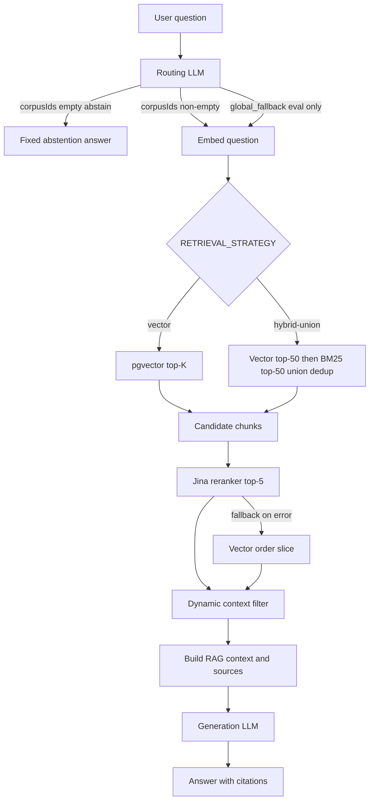

# penal — Multi-corpus legal RAG (French codes)

A **Retrieval-Augmented Generation (RAG)** system for querying **six French legal codes** from structured PDF sources. Given a natural-language question, the pipeline selects relevant corpora, retrieves article chunks, reranks them, filters context, and generates an **answer grounded in retrieved sources** with explicit `[Source N]` citations.

The project is built as a **TypeScript / NestJS** application with a **deterministic RAG pipeline** (not an agent), extensive **offline and staged evaluation** on a **500-question multi-corpus dataset**, and **LangChain** for chat models, embeddings, prompts, structured outputs, and selective **LCEL** composition.

> **Scope note:** The full RAG pipeline is exercised primarily via **CLI scripts** (e.g. `pnpm search:answer`). The HTTP API exposes **health** and a **conversational chat** endpoint that does **not** use the legal chunk store (see [Limitations](#limitations--future-work)).

## Corpora and data

Six corpora are configured in `src/ingestion/corpus-config.ts`:

| Corpus ID | Code name |
|-----------|-----------|
| `code-penal` | Code pénal |
| `code-civil` | Code civil |
| `code-du-travail` | Code du travail |
| `code-du-commerce` | Code de commerce |
| `code-monetaire-et-financier` | Code monétaire et financier |
| `code-de-la-consommation` | Code de la consommation |

Chunk counts from `data/evaluation/corpus-validation-report.json` (generated 2026-09-16):

| Corpus | Chunks |
|--------|-------:|
| code-penal | 1,367 |
| code-civil | 2,919 |
| code-du-travail | 12,177 |
| code-du-commerce | 8,334 |
| code-monetaire-et-financier | 6,645 |
| code-de-la-consommation | 2,242 |
| **Total** | **33,684** |

Ingestion flow: PDF → articles JSON → chunking → embeddings → import into PostgreSQL (`legal_code_chunks` with **pgvector**, 3072 dimensions).

## Architecture



**Orchestration entry point:** `answerQuestion()` in `src/generation/answer-question.ts` (retrieval/rerank via `searchAndRerankQuestion()`).

## Pipeline walkthrough

### Multi-corpus routing

- **Role:** Map a question to one or more corpus IDs (or abstain).
- **Implementation:** `routeQuestion()` → `ROUTER_CHAT_PROMPT` + `ChatOpenAI.withStructuredOutput(RoutingLlmResponseSchema)` (Zod), composed with **LCEL** (`createRouterRoutingChain`: `prompt.pipe(structuredModel)`).
- **Output contract (LLM):** `{ corpusIds: string[] }` only; prompt forbids extra fields.
- **Business validation:** `validateRoutingResult()` (dedup, known corpus IDs via `getCorpusConfig()`).
- **Downstream:** `resolveRoutingForRetrieval()` distinguishes **`routed`**, **`abstain`** (empty router output → **no** embed/retrieval/gen), and **`global_fallback`** (explicit empty corpus list for eval → search all corpora).

Default routing model constant: `gpt-5.6-luna` (`DEFAULT_ROUTING_MODEL`). Optional env: `ROUTING_MODEL` (used in code; not listed in `.env.example`).

### Retrieval

Two strategies (`RETRIEVAL_STRATEGY`, default **`vector`** if unset):

| Strategy | Behavior |
|----------|----------|
| **`vector`** | Embed question → pgvector similarity; default **`retrievalTopK = 30`**. With multiple routed corpora, **per-corpus quota** retrieval (`corpus-quota-retrieval.ts`) reduces single-corpus monopolization. |
| **`hybrid-union`** | Same embedding step → vector top **50** → BM25 top **50** (only when `corpusIds` non-empty) → **`dedupeUnionSimilarChunks`** by `chunkId`. BM25 index is **in-memory per corpus**, loaded from DB. Branches run **sequentially** in code (not `Promise.all`). |

**Why both semantic and lexical:** Vector search captures paraphrase; BM25 helps lexical mismatches (benchmark on 61 diagnostic questions: union **81.7%** gold recall @50 vs vector **68.8%** — see `reports/evaluation/runs/retrieval-hybrid-benchmark-2026-09-22/REPORT.md`).

### Reranking

- **Model:** `jina-reranker-v3.5` (`JINA_RERANKER_MODEL`).
- **Role:** Re-order retrieval candidates; default **`rerankTopK = 5`**.
- **Fallback:** On eligible Jina errors, use first `rerankTopK` chunks in **vector retrieval order** (`rerankStatus: 'fallback'`).

### Dynamic context filtering

- **Pure function:** `dynamicContextFilter()` on reranked chunks.
- **Rules:** Relative score vs best rerank score (default threshold **0.4**); keep at least **`MIN_CONTEXT_CHUNKS = 1`**; cap **`MAX_CONTEXT_CHUNKS = 5`**; for multi-corpus routing, ensure **at least one chunk per routed corpus** when possible.

### Generation

- **Context:** `buildRagContext()` formats numbered sources (`[Source N — code — Article …]`) and joins chunk text.
- **Prompt:** `RAG_GENERATION_CHAT_PROMPT` (system + human with `{question}` / `{context}`); instructs citations `[Source N]`, multicorpus headers, and abstention when context is insufficient.
- **Model:** `RAG_GENERATION_MODEL` env or default `gpt-5.6-luna`.
- **LCEL:** `createRagGenerationChain()` = `prompt.pipe(chatModel).pipe(RunnableLambda)` extracting trimmed text; empty response → `GenerationError`.

### LangChain (actual usage)

| Piece | Where |
|-------|--------|
| `ChatOpenAI` | Routing, generation, judges, dataset generation, conversation stream |
| `OpenAIEmbeddings` | Question/document embeddings (`text-embedding-3-large`, 3072-d) |
| `ChatPromptTemplate` | RAG generation, routing, E2E judges, multicorpus question generation |
| `withStructuredOutput` + **Zod** | Routing, judges, multicorpus LLM dataset builder |
| **LCEL `.pipe()`** | RAG generation chain; routing chain (prompt → structured model) |
| **`RunnableLambda`** | Post-generation text extraction only |
| **Not used in `src/`** | LangGraph, agents, tools, `RunnableParallel`, `RunnablePassthrough`, Langfuse |

Business validation (routing, judge scores, non-empty explanations) stays **outside** LCEL chains.

## Evaluation

Methodology is documented in **`docs/evaluation.md`** (French) and **`docs/evaluation-multicorpus.md`**.

**Shared dataset:** `data/evaluation/legal-multicorpus.questions.json` — **500 questions**:

| Type | Count |
|------|------:|
| single-corpus | 350 |
| multi-corpus | 75 |
| ambiguous | 40 |
| out-of-scope | 35 |

Gold labels use **`(corpusId, articleNumber)`** pairs — never article number alone.

**Metrics by stage** (see `src/evaluation/multicorpus/metrics.ts` and evaluators):

| Stage | Metrics |
|-------|---------|
| Routing | exact match, precision, recall, F1; abstention behavior |
| Retrieval | fractional gold-article recall @K, full gold coverage, corpus coverage |
| Rerank / filter | gold recall after Jina / after filter |
| E2E generation | LLM judge: correctness, completeness, groundedness (0–4); abstention correctness |
| Sources | Source judge: source relevance, source coverage |

**Illustrative results (from committed reports, not re-run on every clone):**

- **Routing V3.1** (500 Q, `reports/evaluation/runs/2026-09-19T22-46-46-088Z/`): **93.6%** exact match, F1 **0.950** (`docs/evaluation.md`).
- **Hybrid union offline** (61 Q cohort): union **81.7%** gold recall @50 vs vector **68.8%** (`retrieval-hybrid-benchmark-2026-09-22`).
- **E2E multicorpus run** (`reports/evaluation/runs/2026-09-21T16-59-10-310Z/`): routing variant vs baseline judge averages (e.g. correctness **3.622** vs **3.534** on evaluated subset — see report for full table).

Evaluation philosophy: **targeted benchmarks and caches** before full 500-question E2E (cost/latency); see `docs/evaluation.md` §3–4.

**Useful commands:**

```bash
pnpm evaluate:multicorpus      # staged multicorpus eval harness
pnpm evaluate:e2e              # E2E pipeline eval
pnpm evaluate:e2e:judge        # LLM-as-judge on E2E results
pnpm smoke:abstention          # abstention pipeline skip
pnpm validate:rag              # project validation script
```

## Engineering decisions

- **Deterministic pipeline** instead of tool-calling agents: predictable cost, easier regression, clearer failure attribution.
- **Separate retrieval and reranking:** cheap wide recall, then cross-encoder-style rerank on a small set.
- **Hybrid union** when lexical gaps hurt vector-only recall (evidence in offline benchmark).
- **Structured outputs (Zod)** for machine-readable router/judge/dataset fields; **free-text generation** for user-facing answers.
- **Schema validation ≠ business validation** (e.g. routing Zod → `validateRoutingResult()`).
- **Staged evaluation + disk cache** (`reports/evaluation/runs/...`, `e2e-cache`) to limit API spend.
- **Vitest** unit/integration tests across routing, retrieval, generation, evaluation logic.

## Tech stack

Verified from `package.json` and implementation:

- **Runtime:** Node.js (ES modules), **TypeScript**
- **API:** **NestJS 12**, **Fastify**
- **Database:** **PostgreSQL** + **pgvector** (`pgvector/pgvector:pg16` in `docker-compose.yml`)
- **ORM:** **Prisma 7**
- **LLM / embeddings:** **OpenAI** API + **LangChain** (`@langchain/openai`, `@langchain/core`)
- **Reranking:** **Jina** Rerank API
- **Validation:** **Zod**, class-validator (HTTP DTOs)
- **Tests:** **Vitest**
- **PDF ingestion:** pdfjs-dist

## Project structure

```
src/
  ingestion/          PDF → articles; corpus-config
  chunking/           Article → chunks (target 1500 / max 2000 chars)
  persistence/        Import chunks + embeddings into Postgres
  retrieval/          Vector search, BM25, hybrid-union, quota
  routing/            LLM corpus routing + validation
  reranking/          Jina rerank + fallback
  generation/         Context filter, RAG prompts, answerQuestion
  evaluation/         Multicorpus + E2E metrics, judges, harness
  conversations/      SSE chat (no legal RAG store)
  langchain/          Shared ChatOpenAI / embeddings helpers
  openai/             Nest façade (embeddings, stream, createChatModel)
scripts/              CLI: ingest, chunk, embed, search, evaluate
data/                 PDFs, processed JSON, evaluation dataset
reports/evaluation/   Run artifacts and REPORT.md files
docs/                 evaluation strategy, multicorpus dataset docs
```

## Running locally

**Prerequisites:** Node.js, pnpm, Docker (for Postgres).

1. **Start Postgres with pgvector:**

   ```bash
   docker compose up -d
   ```

2. **Install and configure env:**

   ```bash
   pnpm install
   cp .env.example .env
   ```

   Variables in **`.env.example`**:

   | Variable | Purpose |
   |----------|---------|
   | `PORT` | HTTP port (default 3000) |
   | `DATABASE_URL` | PostgreSQL connection |
   | `OPENAI_API_KEY` | OpenAI |
   | `OPENAI_MODEL` | Default chat model for conversation streaming |
   | `OPENAI_EMBEDDING_MODEL` | Embeddings (default `text-embedding-3-large`) |
   | `JINA_API_KEY` | Jina reranker |
   | `RAG_GENERATION_MODEL` | RAG generation |
   | `RAG_EVALUATION_JUDGE_MODEL` | E2E judge |

   Additional variables used in code but **not** in `.env.example`: `RETRIEVAL_STRATEGY` (`vector` \| `hybrid-union`), `ROUTING_MODEL` (see `src/routing/constants.ts`).

3. **Database schema:**

   ```bash
   pnpm prisma:generate
   pnpm prisma:migrate:dev
   ```

4. **Ingest pipeline (per corpus or all):** see `package.json` scripts `ingest:*`, `chunk:*`, `embed:*`, `import:*`.

5. **Run API:**

   ```bash
   pnpm start:dev
   ```

6. **Run full RAG from CLI:**

   ```bash
   pnpm search:answer "Votre question juridique"
   ```

## Tests

```bash
pnpm test          # Vitest unit + integration (src/**)
pnpm test:e2e      # Vitest e2e config
pnpm test:cov      # Coverage
pnpm build         # nest build
pnpm lint          # oxlint
```

Tests cover routing validation, hybrid union dedup, dynamic context filter, LangChain prompt parity, LCEL chains, multicorpus metrics, and selected DB integration paths.

## Limitations / future work

**Implemented today**

- Multi-corpus RAG pipeline with routing, retrieval (vector + optional hybrid-union), Jina rerank, context filter, cited generation.
- Offline/multicorpus evaluation harness and archived run reports.
- LangChain models, prompts, structured output, partial LCEL.

**Not implemented / known limits**

- HTTP API does **not** expose the full RAG pipeline; chat endpoint explicitly states **no legal document store** yet (`ChatService` system prompt).
- No LangGraph, agents, MCP, or Langfuse in this repo.
- Hybrid vector/BM25 branches are sequential; eval concurrency uses custom worker pools, not LangChain `.batch()`.
- LLM judges are evaluation proxies, not legal ground truth.

**Potential extensions:** LangGraph orchestration, tool use, jurisprudence corpora, production observability (e.g. Langfuse), streaming RAG answers over SSE.

---

For evaluation details and run history, see **`docs/evaluation.md`**. For interview preparation notes (French), see **`docs/interview-notes.md`**.
