<link rel="stylesheet" href="rag-blueprint.css">

<div class="cover">

# RAG Blueprint — De zéro à un RAG production-ready

<p class="subtitle">Guide d'ingénierie réutilisable — exemplifié sur le projet Code pénal</p>

<p class="meta">Version 1.0 · Projet <code>penal</code> · NestJS 12 · TypeScript · PostgreSQL · pgvector</p>

</div>

<div class="toc">

## Sommaire

1. [Introduction](#1-introduction)
2. [Méthodologie de travail](#2-méthodologie-de-travail)
3. [Ingestion](#3-ingestion)
4. [Chunking](#4-chunking)
5. [Embeddings](#5-embeddings)
6. [Stockage](#6-stockage)
7. [Retrieval](#7-retrieval)
8. [Reranking](#8-reranking)
9. [Contexte](#9-contexte-context-selection)
10. [Génération](#10-génération)
11. [Évaluation](#11-évaluation)
12. [Architecture d'évaluation](#12-architecture-dévaluation-complète)
13. [Alternatives et arbres de décision](#13-alternatives-et-arbres-de-décision)
14. [Diagnostic](#14-diagnostic)
15. [Multi-corpus](#15-multi-corpus)
16. [Limites du projet](#16-limites-du-projet)
17. [Definition of Done](#17-definition-of-done)
18. [Règle fondamentale](#18-règle-fondamentale)

</div>

---

## 1. Introduction

Un système **RAG** (Retrieval-Augmented Generation) ne se résume pas à « brancher un LLM sur des documents ». C'est une **chaîne de transformations** où chaque maillon peut amplifier ou dégrader la qualité finale. Une ingestion bruyante produit des chunks incohérents ; des chunks mal découpés produisent des embeddings trompeurs ; un retrieval trop large noie le LLM dans du bruit.

Ce blueprint décrit **comment construire un RAG production-ready**, étape par étape, avec une méthode reproductible. Le projet **Code pénal français** sert d'exemple concret : 1 301 articles juridiques, 1 368 chunks, embeddings `text-embedding-3-large` (3 072 dimensions), stockage PostgreSQL + pgvector, retrieval Top-20, reranking Jina v3.5, filtrage de contexte dynamique à 40 % de score relatif.

<div class="callout callout-retain">
<strong>À retenir</strong>
Ce document est un <strong>guide d'ingénierie</strong>, pas une README de projet. Les choix documentés (modèles, seuils, tailles) sont ceux qui ont fonctionné <em>pour ce corpus et ce benchmark</em> — pas des vérités universelles.
</div>

### 1.1 Pipeline horizontal

Chaque requête utilisateur traverse neuf étapes. Les étapes 1 à 6 préparent le corpus ; les étapes 7 à 9 servent la requête ; l'évaluation (sections 11+ de ce blueprint) valide l'ensemble.


| Étape | Rôle | Exemple Code pénal |
|-------|------|-------------------|
| Ingestion | Extraire et structurer la source brute | PDF Légifrance → JSON articles |
| Chunking | Découper en unités indexables | 1 301 articles → 1 368 chunks |
| Embedding | Vectoriser le texte | `text-embedding-3-large`, 3 072 dims |
| Stockage | Persister chunks + vecteurs | PostgreSQL + pgvector |
| Retrieval | Trouver les candidats pertinents | Cosine distance, Top-20 |
| Reranking | Réordonner par pertinence query-chunk | Jina Reranker v3.5 |
| Context | Sélectionner ce qui entre dans le prompt | Seuil relatif 40 % |
| Generation | Produire la réponse grounded | LLM + prompt système |
| Evaluation | Mesurer, diagnostiquer, itérer | Recall@K, MRR, LLM-as-Judge |

### 1.2 Méthodologie verticale

Pour **chaque** étape du pipeline, appliquer la même démarche en huit niveaux. C'est le fil conducteur de ce document : ne jamais implémenter une technique « parce que les autres le font », mais parce qu'un problème mesuré la justifie.

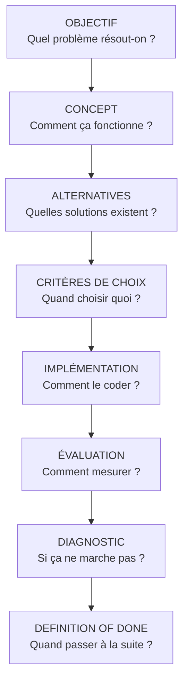

**Pourquoi cette méthode ?** Un RAG échoue rarement à un seul endroit identifiable. Sans objectif clair par étape, on mélange les causes (chunking vs embedding vs retrieval). Sans alternatives documentées, on sur-ingénierie (reranker LLM à 45 s de latence pour zéro gain métrique). Sans Definition of Done, on passe à l'étape suivante avec des fondations fragiles.

<div class="callout callout-trap">
<strong>Piège fréquent</strong>
Copier l'architecture d'un tutoriel LangChain sans adapter au corpus. Un PDF juridique Légifrance, une doc technique Markdown et une base de tickets support exigent des pipelines d'ingestion et de chunking <strong>radicalement différents</strong>.
</div>

### 1.3 Exemple fil rouge : Code pénal

| Paramètre | Valeur |
|-----------|--------|
| Corpus | Code pénal français (PDF Légifrance) |
| Articles extraits | 1 301 |
| Chunks produits | 1 368 |
| `TARGET_SIZE` / `MAX_SIZE` | 1 500 / 2 000 caractères |
| Modèle d'embedding | `text-embedding-3-large` (3 072 dims) |
| Stockage vectoriel | PostgreSQL 16 + pgvector |
| Retrieval | Top-20, distance cosine |
| Reranker | `jina-reranker-v3.5` |
| Filtrage contexte | Seuil relatif 40 % du meilleur score |

Stack technique : TypeScript strict, ESM, NestJS 12, Prisma 7, Vitest. **Pas de LangChain** — pipelines offline explicites dans `src/` et `scripts/`.

---

## 2. Méthodologie de travail

Les sections 3 (Ingestion) et 4 (Chunking) appliquent intégralement la structure A→I définie ci-dessous. Les sections 5 et 6 (Embeddings, Stockage) introduisent les concepts et les choix du projet ; leurs structures A→I complètes seront développées dans la suite de ce blueprint.

### Structure A→I (applicable à chaque étape)

| Lettre | Section | Question clé |
|--------|---------|--------------|
| **A** | Objectif | Quel problème cette étape résout-elle ? |
| **B** | Concept | Que se passe-t-il techniquement ? |
| **C** | Alternatives | Quelles solutions existent ? |
| **D** | Comment choisir ? | Quelles règles pratiques et arbres de décision ? |
| **E** | Notre choix | Qu'avons-nous choisi et pourquoi (pour CE projet) ? |
| **F** | Implémentation | Fichiers, modules, décisions de code |
| **G** | Évaluation | Métriques, tests, signaux à surveiller |
| **H** | Problèmes fréquents | Symptôme → cause → mesure → solution |
| **I** | Definition of Done | Checklist avant de passer à l'étape suivante |

<div class="callout callout-choose">
<strong>Quand choisir quoi ?</strong>
Avant d'ajouter une complexité (reranker, hybrid search, overlap, OCR…) :<br/>
1. Identifier le <strong>symptôme mesuré</strong> (Recall@K faible, hallucinations, latence…)<br/>
2. Formuler une <strong>hypothèse</strong> liée à une étape précise<br/>
3. Implémenter la solution minimale<br/>
4. Comparer sur le <strong>même benchmark</strong><br/>
5. Décider : garder, ajuster, ou abandonner
</div>

### Principes transverses

1. **Transformation technique, pas interprétation** — L'ingestion ne reformule pas le droit ; le chunking ne résume pas les articles.
2. **Traçabilité** — Chaque chunk porte ses métadonnées (article, pages, hiérarchie juridique, index).
3. **Idempotence** — Relancer `pnpm ingest:code-penal` ou `pnpm chunk:code-penal` reproduit le même artefact JSON.
4. **Tests sur corpus réel** — Les tests d'intégration s'exécutent sur le PDF et les JSON produits, pas uniquement sur des fixtures minimales.
5. **Mesurer avant d'optimiser** — Aucun seuil (40 %, Top-20, 2 000 caractères) n'est sacré ; chacun est justifié par des mesures sur le benchmark actuel.

---

<div class="section-break"></div>

## 3. Ingestion

### A. Objectif

Transformer une **source brute** (PDF, HTML, API, base SQL…) en **documents structurés** prêts pour le chunking : texte fidèle, métadonnées exploitables, artefacts reproductibles.

**Problème résolu :** le contenu source n'est pas directement searchable ni embeddable. Un PDF Légifrance contient des pieds de page répétés, des césures de ligne, une hiérarchie implicite (Livre → Titre → Chapitre → Article) qu'il faut extraire explicitement.

### B. Concept

L'ingestion est un pipeline séquentiel en quatre phases :

```
Source brute → Extraction → Nettoyage → Parsing structurel → JSON structuré
```

1. **Extraction** — Récupérer le texte brut page par page (pdfjs-dist pour PDF, cheerio pour HTML, driver SQL pour BDD…).
2. **Nettoyage** — Supprimer les artefacts de mise en page (footers, césures, espaces insécables) **sans** altérer le sens juridique.
3. **Parsing structurel** — Identifier les entités documentaires (articles, sections, chapitres) et propager la hiérarchie comme métadonnées.
4. **Sérialisation** — Produire un JSON versionné avec stats, rapport et horodatage.

<div class="callout callout-retain">
<strong>À retenir</strong>
Séparer les <strong>métadonnées document</strong> (date de modification Légifrance, date de génération PDF) des <strong>métadonnées article</strong> (numéro, livre, pages). Les dates document vont dans le rapport d'ingestion, pas dans le contenu des articles.
</div>

### C. Alternatives

| Approche | Principe | Avantages | Inconvénients | Complexité |
|----------|----------|-----------|---------------|------------|
| **Extraction texte native (pdfjs, pdftotext)** | Parser la couche texte du PDF | Rapide, déterministe, pas de coût API | Échoue sur PDF scannés ; layout complexe mal géré | Faible |
| **OCR (Tesseract, Azure DI, Google Vision)** | Reconnaissance optique | Indispensable pour scans / images | Lent, coûteux, erreurs de reconnaissance | Élevée |
| **HTML / Markdown direct** | Source déjà structurée | Métadonnées riches, pas de bruit PDF | Disponibilité variable selon la source | Faible |
| **API officielle (Légifrance PISTE, etc.)** | Données structurées JSON/XML | Fidélité juridique, versioning | Quotas, authentification, dépendance externe | Moyenne |
| **LLM extraction** | Demander au LLM de structurer | Flexible sur formats exotiques | Non déterministe, coûteux, risque d'hallucination | Élevée |
| **Pipeline ETL (Airbyte, custom SQL)** | Sync depuis BDD / data warehouse | Idéal pour données déjà relationnelles | Overkill pour un corpus statique | Variable |

#### Nettoyage : spectre d'intervention

| Niveau | Actions | Risque |
|--------|---------|--------|
| Minimal | Footers, form feeds, NFC, espaces insécables | Très faible |
| Modéré | Césures de ligne, fusion repliures PDF | Faible si règles conservatrices |
| Agressif | Correction orthographique, déduplication sémantique | **Élevé** — altère le texte source |

### D. Comment choisir ?

<div class="callout callout-choose">
<strong>Quand choisir quoi ?</strong>
<ul>
<li><strong>PDF natif texte</strong> (export FOP, Word→PDF) → extraction pdfjs, pas d'OCR</li>
<li><strong>PDF scanné</strong> → OCR obligatoire ; valider manuellement un échantillon</li>
<li><strong>HTML structuré</strong> (doc technique, wiki) → parser le DOM, conserver les balises sémantiques comme métadonnées</li>
<li><strong>Markdown</strong> → decouper par headings (<code>#</code>, <code>##</code>)</li>
<li><strong>JSON / API</strong> → mapping direct ; l'ingestion est un adaptateur de schéma</li>
<li><strong>Base SQL</strong> → requête + export ; versioning via colonne <code>updated_at</code></li>
<li><strong>Corpus juridique officiel</strong> → privilégier API ou PDF Légifrance ; ne jamais paraphraser via LLM</li>
</ul>
</div>

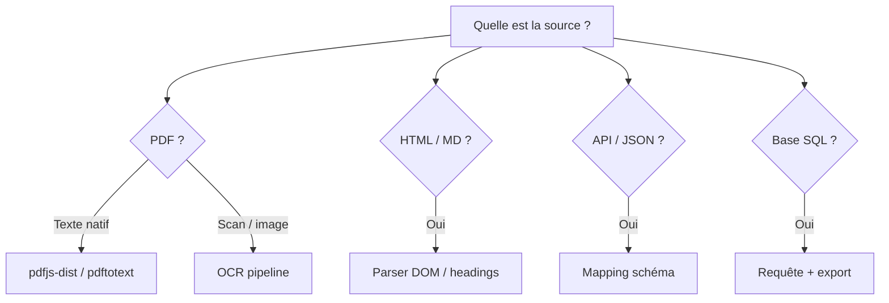

**Règles pratiques :**

- Commencer par l'option **la plus simple et déterministe**.
- Ne pas ajouter d'OCR si le PDF contient du texte sélectionnable.
- Toujours **inspecter manuellement** 5–10 documents représentatifs avant de valider le pipeline.
- Prévoir un champ `warnings[]` dans le rapport pour signaler les anomalies (caractères de remplacement, pages vides…).

### E. Notre choix dans ce projet

| Décision | Choix | Justification |
|----------|-------|---------------|
| Source | `data/code-penal.pdf` (408 pages, Apache FOP) | Export Légifrance officiel, texte natif |
| Extraction | `pdfjs-dist` via `extract-pdf.ts` | Pas de scan ; pas de dépendance binaire externe |
| Nettoyage | Conservateur (`clean-text.ts`) | Footers Légifrance, césures, NFC — rien de plus |
| Parsing | Regex + machine à états (`parse-structure.ts`) | Hiérarchie Partie/Livre/Titre/Chapitre/Section/Article |
| Formats articles | `111-1`, `113-2-1`, `R131-1`, `224-1 A`, `D712-9` | Regex élargi après inspection du PDF réel |
| Sortie | JSON par article avec métadonnées | 1 301 articles dans `code-penal.articles.json` |
| Framework | Scripts offline (`tsx`), pas de NestJS | Ingestion = batch, pas un service HTTP |

<div class="callout callout-trap">
<strong>Piège fréquent</strong>
Un regex d'articles trop strict : la première version ne capturait que <code>Article 111-1</code> et manquait 162 articles réglementaires (<code>R131-1</code>), à suffixe alphabétique (<code>224-1 A</code>) ou à segments multiples (<code>113-2-1</code>). Toujours valider le <strong>compte final</strong> contre une source de vérité.
</div>

### F. Implémentation

#### Arborescence

```
src/ingestion/
├── ingest-code-penal.ts    # Orchestrateur principal
├── extract-pdf.ts          # Extraction pdfjs-dist page par page
├── clean-text.ts           # Nettoyage conservateur
├── parse-structure.ts      # Parsing hiérarchique + articles
├── types.ts                # PenalCodeArticle, PenalCodeIngestionResult
└── __tests__/
    ├── clean-text.spec.ts
    ├── parse-structure.spec.ts
    └── ingest-code-penal.integration.spec.ts

scripts/ingest-code-penal.ts   # CLI : pnpm ingest:code-penal
```

#### Flux de données

```
data/code-penal.pdf
    ↓ extractPdfPages()
pages brutes [{ pageNumber, text }]
    ↓ cleanPageText() + isBlankPage()
pages nettoyées
    ↓ pageLinesFromCleanedPages()
lignes avec numéro de page
    ↓ parseStructure()
articles[] + métadonnées hiérarchiques
    ↓ writeFile()
data/processed/code-penal.articles.json
data/processed/ingestion-report.json
```

#### Schéma de sortie (`PenalCodeIngestionResult`)

```json
{
  "source": { "file": "data/code-penal.pdf", "type": "pdf", "pageCount": 408 },
  "extractedAt": "2026-09-13T…",
  "stats": { "articleCount": 1301, "skippedPages": 0, "warnings": [] },
  "report": { "lastModified": "…", "generatedAt": "…", "durationMs": 12345 },
  "articles": [
    {
      "articleNumber": "111-1",
      "content": "Les infractions pénales…",
      "metadata": {
        "articleNumber": "111-1",
        "livre": "Livre Ier : Dispositions générales",
        "pageStart": 1,
        "pageEnd": 1,
        "source": "data/code-penal.pdf",
        "sourceType": "pdf"
      }
    }
  ]
}
```

#### Décisions techniques notables

- **`clean-text.ts`** — Regex `HYPHENATION_LINE_BREAK_REGEX` : fusionne `mot-\nsuite` mais ignore les tirets juridiques intra-ligne et les numéros d'articles.
- **`parse-structure.ts`** — Chaque ligne structurelle (Livre, Titre, Article…) flush l'article courant et met à jour un contexte hiérarchique hérité.
- **Dates document** — `extractFooterDates()` lit le pied de page Légifrance une fois ; stocké dans `report`, absent des métadonnées article.
- **Idempotence** — Pas de side-effect hors écriture JSON ; relancer le script écrase les fichiers de sortie.

### G. Évaluation

| Signal | Comment le vérifier | Seuil Code pénal |
|--------|---------------------|------------------|
| Compte d'articles | `stats.articleCount` | 1 301 (entre 1 200 et 1 350) |
| Absence de footers | Regex sur `article.content` | 0 occurrence « Dernière modification » |
| Formats spéciaux | Articles témoins | `111-1`, `R131-1`, `224-1 A`, `D712-9` présents |
| Hiérarchie | `metadata.livre`, `metadata.titre` | Définis sur articles représentatifs |
| Pages vides | `stats.skippedPages` | Documenté, pas silencieux |
| Reproductibilité | Relancer 2×, diff JSON | Identique (hors `extractedAt`) |

**Tests automatisés :**

- `ingest-code-penal.integration.spec.ts` — PDF réel, timeout 120 s
- `parse-structure.spec.ts` — Fixtures unitaires hiérarchie et multi-alinéas
- `clean-text.spec.ts` — Césures, footers, caractères de remplacement

<div class="callout callout-retain">
<strong>À retenir</strong>
L'ingestion seule ne se mesure pas en Recall@K. Ses métriques sont : <strong>complétude</strong> (tous les articles ?), <strong>fidélité</strong> (texte verbatim ?), <strong>propreté</strong> (pas de bruit ?), <strong>structure</strong> (métadonnées correctes ?).
</div>

### H. Problèmes fréquents

| Symptôme | Cause probable | Comment mesurer | Solution |
|----------|---------------|-----------------|----------|
| Compte d'articles trop bas | Regex incomplet, pages ignorées | Comparer à source officielle | Élargir `ARTICLE_LINE_REGEX`, inspecter pages manquantes |
| Footers dans le contenu | Regex footer incomplet | Grep « Dernière modification » | Ajuster `LEGIFRANCE_FOOTER_REGEX` |
| Mots coupés (`infractions` → `infrac-\ntions`) | Césures non fusionnées | Grep `-\n` dans JSON | Vérifier `fixHyphenationLineBreaks` |
| Hiérarchie vide | Lignes structurelles non reconnues | Échantillon `metadata.livre` | Ajouter patterns (Partie, Sous-section…) |
| Caractères `` | Encodage PDF | `warnings: replacement_character_detected` | Font mapping pdfjs, post-traitement |
| Contenu dupliqué | Double flush ou pages répétées | Hash par articleNumber | Debugger la machine à états |
| Ingestion lente | PDF volumineux, pdfjs page par page | `report.durationMs` | Paralléliser pages, cache intermédiaire |

### I. Definition of Done

<ul class="checklist">
<li>Pipeline CLI exécutable (<code>pnpm ingest:code-penal</code>)</li>
<li>JSON de sortie conforme au schéma TypeScript (<code>PenalCodeIngestionResult</code>)</li>
<li>Compte d'articles validé contre le corpus attendu (1 301)</li>
<li>Zéro footer / form feed dans le contenu article</li>
<li>Métadonnées hiérarchiques sur articles témoins</li>
<li>Dates document dans le rapport, pas dans les articles</li>
<li>Tests unitaires + intégration passent sur le PDF réel</li>
<li>Rapport d'ingestion avec stats, warnings, durée</li>
<li>Documentation des formats d'articles supportés</li>
</ul>

---

<div class="section-break"></div>

## 4. Chunking

### A. Objectif

Découper les documents structurés en **chunks** — unités de texte indexables — optimisées pour l'embedding et le retrieval.

**Problème résolu :** un article de 8 000 caractères dépasse la fenêtre efficace d'un embedding ; un chunk de 200 caractères perd le contexte juridique. Le chunking cherche un **compromis** entre granularité sémantique et contraintes techniques du modèle d'embedding.

### B. Concept

Le chunking du Code pénal suit une stratégie **structure-aware** en trois niveaux :

```
Article → Unités juridiques → Parts → Chunks
```

1. **Segmentation** (`segment-units.ts`) — Reconstruire les unités juridiques (alinéas, items de liste `1°`, sections romaines `I.-`, items alphabétiques `a)`) à partir des retours à la ligne PDF. La majorité des `\n` simples sont des **repliures PDF**, pas des frontières sémantiques.
2. **Expansion** (`group-chunks.ts`) — Si une unité dépasse `MAX_SIZE`, la subdiviser par phrases puis par coupure dure (dernier espace).
3. **Regroupement** — Accumuler des parts dans un buffer jusqu'à approcher `TARGET_SIZE`, sans dépasser `MAX_SIZE`. Séparateur : `\n\n` (`UNIT_SEPARATOR`).

**Pas d'overlap.** Chaque caractère de l'article appartient à exactement un chunk (sauf séparateurs `\n\n` entre unités fusionnées).

| Paramètre | Valeur | Rôle |
|-----------|--------|------|
| `TARGET_SIZE` | 1 500 | Taille visée par chunk |
| `MAX_SIZE` | 2 000 | Plafond strict (hard limit) |
| `UNIT_SEPARATOR` | `\n\n` | Jointure entre unités dans un chunk |

<div class="callout callout-retain">
<strong>À retenir</strong>
Sur le corpus Code pénal : 1 301 articles → 1 368 chunks. Seuls ~67 articles dépassent 2 000 caractères et sont multi-chunks. La grande majorité des articles tient en un seul chunk verbatim.
</div>

### C. Alternatives

| Stratégie | Principe | Avantages | Inconvénients | Quand l'utiliser |
|-----------|----------|-----------|---------------|------------------|
| **Fixed-size** | Couper tous les N caractères | Trivial à implémenter | Coupe au milieu des phrases/unités | Texte homogène sans structure |
| **Recursive** | Hiérarchie de séparateurs (`\n\n`, `\n`, `. `, ` `) | Bon compromis généraliste | Ignore la structure domaine | Docs techniques, prose |
| **Semantic** | Couper quand la similarité chute | Frontières sémantiques fines | Coûteux (embeddings intermédiaires) | Texte non structuré long |
| **Structure-aware** | Respecter la structure documentaire | Préserve l'intégrité juridique | Spécifique au domaine | Code legal, specs, API docs |
| **Sliding window / overlap** | Fenêtre glissante avec recouvrement | Contexte aux frontières | Duplication, plus de chunks, bruit retrieval | Quand la perte de contexte aux frontières est critique |
| **One-doc-one-chunk** | Un document = un chunk | Simplicité maximale | Impossible si docs > limite embedding | Articles courts (< limite) |
| **Parent-child** | Petits chunks + doc parent | Retrieval fin + contexte large | Complexité stockage/retrieval | Longs documents avec sections |

#### Taille des chunks : trade-offs

| Taille | Effet sur retrieval | Effet sur génération |
|-------|--------------------|--------------------|
| Trop petit (< 300) | Précision haute, contexte insuffisant | LLM manque d'information |
| Optimal (500–2 000) | Bon équilibre | Contexte exploitable |
| Trop grand (> 4 000) | Embedding « dilué », bruit | Lost-in-the-middle, coût tokens |

### D. Comment choisir ?

<div class="callout callout-choose">
<strong>Quand choisir quoi ?</strong>
<ul>
<li><strong>Corpus juridique / réglementaire structuré</strong> → structure-aware, frontières = unités juridiques</li>
<li><strong>Documentation technique avec headings</strong> → decouper par section Markdown/HTML</li>
<li><strong>Texte non structuré (articles de blog, transcripts)</strong> → recursive ou semantic</li>
<li><strong>FAQ courte</strong> → one-chunk-per-doc</li>
<li><strong>Frontières floues + questions cross-section</strong> → envisager overlap 10–20 % (avec benchmark !)</li>
<li><strong>Docs très longs + questions localisées</strong> → parent-child retrieval</li>
</ul>
</div>

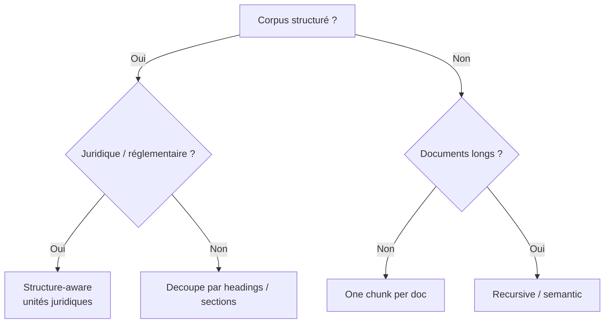

**Overlap : quand oui, quand non ?**

| Situation | Overlap recommandé |
|-----------|-------------------|
| Articles autonomes (< 2 000 chars) | Non — verbatim suffit |
| Phrases coupées aux frontières | Overlap léger (10 %) ou meilleure segmentation |
| Corpus juridique avec unités claires | Non — risque de duplication et confusion retrieval |
| Texte continu sans structure | Overlap 15–20 % à benchmarker |

### E. Notre choix dans ce projet

| Décision | Choix | Justification |
|----------|-------|---------------|
| Stratégie | Structure-aware | Code pénal = articles + alinéas + listes numérotées |
| `TARGET_SIZE` | 1 500 | Sous la limite embedding, chunks informatifs |
| `MAX_SIZE` | 2 000 | Plafond strict ; 0 chunk au-dessus (validé par tests) |
| Overlap | Aucun | Unités juridiques préservées ; pas de duplication |
| Segmentation | Reconstruction alinéas PDF | 85 %+ des `\n` = repliures, pas frontières |
| Frontières fortes | `1°`, `I.-`, `a)` | Marqueurs juridiques fiables |
| Articles ≤ 2 000 | 1 chunk verbatim | Contenu strictement identique à la source |
| Articles > 2 000 | Multi-chunks sans duplication | Conservation complète des unités |
| `chunkId` | `{articleNumber}#{index}` | Ex. `121-3#0`, `121-3#1` |

**Statistiques réelles :**

| Métrique | Valeur |
|----------|--------|
| Articles | 1 301 |
| Chunks | 1 368 |
| Articles single-chunk | ~1 234 |
| Articles multi-chunks | ~67 |
| `chunksOverMax` | 0 |
| Taille max observée | ≤ 2 000 |

### F. Implémentation

#### Arborescence

```
src/chunking/
├── chunk-code-penal.ts     # Orchestrateur + stats
├── segment-units.ts          # Reconstruction unités juridiques
├── group-chunks.ts           # Expansion + regroupement
├── build-chunk.ts            # Construction objet PenalCodeChunk
├── constants.ts              # TARGET_SIZE, MAX_SIZE, UNIT_SEPARATOR
├── types.ts                  # LegalUnit, PenalCodeChunk, SplitLevel
└── __tests__/
    ├── segment-units.spec.ts
    ├── group-chunks.spec.ts
    └── chunk-code-penal.integration.spec.ts

scripts/chunk-code-penal.ts   # CLI : pnpm chunk:code-penal
```

#### Algorithme de segmentation (`segment-units.ts`)

```
content
  ↓ split par \n\n (blocs durs)
  ↓ pour chaque bloc, mergeLinesInBlock()
      ├── frontière forte (1°, I.-, a)) → nouvelle unité
      ├── fin de phrase + majuscule → nouvelle unité
      └── sinon → fusionner (repliure PDF)
  ↓ LegalUnit[] avec type (paragraph, list-item, roman-section, alpha-item)
```

#### Algorithme de regroupement (`group-chunks.ts`)

```
LegalUnit[]
  ↓ expandUnitsToParts(maxSize)
      ├── unit ≤ max → 1 part
      ├── unit > max → splitBySentences
      └── sentences > max → splitByHardBoundary (dernier espace)
  ↓ groupPartsIntoChunks(targetSize, maxSize)
      ├── buffer + part > maxSize → flush buffer, nouveau chunk
      └── flush final
  ↓ PenalCodeChunk[] avec metadata (unitStart, unitEnd, splitLevel)
```

#### Schéma de sortie (`PenalCodeChunkingResult`)

```json
{
  "source": { "articlesFile": "data/processed/code-penal.articles.json", "articleCount": 1301 },
  "config": { "targetSize": 1500, "maxSize": 2000 },
  "stats": {
    "chunkCount": 1368,
    "singleChunkArticles": 1234,
    "multiChunkArticles": 67,
    "maxChunkSize": 2000,
    "avgChunkSize": 1180,
    "chunksOverMax": 0
  },
  "chunks": [
    {
      "chunkId": "111-1#0",
      "articleNumber": "111-1",
      "content": "Les infractions pénales…",
      "charCount": 312,
      "metadata": {
        "livre": "Livre Ier : Dispositions générales",
        "chunkIndex": 0,
        "chunkCount": 1,
        "unitStart": 0,
        "unitEnd": 2,
        "unitCount": 3,
        "pageStart": 1,
        "pageEnd": 1
      }
    }
  ]
}
```

#### Niveaux de split (`SplitLevel`)

| Niveau | Quand | Exemple |
|--------|-------|---------|
| `unit` | Unité juridique intacte | Alinéa standard |
| `sentence` | Unité > MAX, phrases ≤ MAX | Long alinéa multi-phrases |
| `hard` | Phrases > MAX | Coupure au dernier espace |

### G. Évaluation

| Signal | Test | Attendu |
|--------|------|---------|
| Couverture | Chaque article a ≥ 1 chunk | 1 301 / 1 301 |
| Plafond taille | `charCount ≤ MAX_SIZE` | 0 violation |
| Verbatim (courts) | Articles ≤ 2 000 chars | 1 chunk = contenu source exact |
| Conservation (longs) | Articles > 2 000 chars | Union des parts = unités originales, 0 duplication |
| Métadonnées | `chunkId`, hiérarchie | Format `{article}#{index}`, livre/titre présents |
| Propreté | Pas de footer | Grep négatif |
| Stats | `chunking-report.json` | Compteurs cohérents |

**Tests automatisés :**

- `chunk-code-penal.integration.spec.ts` — JSON réel, 8 assertions structurelles
- `segment-units.spec.ts` — Repliures, listes, sections romaines
- `group-chunks.spec.ts` — Regroupement, split par phrases, hard boundary

**Métriques aval (indirectes) :** un mauvais chunking se manifeste par un Recall@K faible *sur des questions ciblant des articles longs*. Ces métriques s'évaluent au stade retrieval (section 7+), pas au stade chunking seul.

<div class="callout callout-trap">
<strong>Piège fréquent</strong>
Supposer que <code>\n</code> = alinéa. Sur le PDF Légifrance, ~85 % des retours à la ligne sont des repliures de mise en page. Fusionner d'abord, couper ensuite sur des signaux forts.
</div>

### H. Problèmes fréquents

| Symptôme | Cause probable | Comment mesurer | Solution |
|----------|---------------|-----------------|----------|
| Chunks > MAX_SIZE | Split insuffisant | `stats.chunksOverMax > 0` | Renforcer `splitByHardBoundary` |
| Perte de texte | Bug flush / buffer | Comparer caractères source vs union chunks | Tester conservation (test intégration) |
| Duplication | Overlap involontaire | Set de parts vs liste | Vérifier unicité des parts |
| Chunks trop petits | TARGET_SIZE trop bas ou frontières trop agressives | Distribution `charCount` | Ajuster TARGET ou règles de fusion |
| Retrieval rate bas sur articles longs | Coupure au milieu d'une unité juridique | Questions ciblant multi-chunks | Améliorer segmentation, pas overlap aveugle |
| `chunkId` instables | Index non déterministe | Diff entre 2 runs | Tri stable, pas de hash aléatoire |
| Métadonnées manquantes | Héritage ingestion incomplet | Échantillon `metadata.livre` | Remonter au pipeline ingestion |

### I. Definition of Done

<ul class="checklist">
<li>Pipeline CLI exécutable (<code>pnpm chunk:code-penal</code>)</li>
<li>JSON conforme à <code>PenalCodeChunkingResult</code></li>
<li>1 368 chunks couvrant 1 301 articles (≥ 1 chunk par article)</li>
<li>0 chunk au-dessus de <code>MAX_SIZE = 2000</code></li>
<li>Articles ≤ 2 000 : contenu verbatim dans un seul chunk</li>
<li>Articles > 2 000 : conservation complète sans duplication</li>
<li><code>chunkId</code> stable au format <code>{articleNumber}#{index}</code></li>
<li>Métadonnées juridiques héritées + index de chunk (<code>chunkIndex</code>, <code>unitStart</code>, <code>unitEnd</code>)</li>
<li>Tests unitaires + intégration passent</li>
<li>Rapport <code>chunking-report.json</code> avec stats et durée</li>
</ul>

---

<div class="section-break"></div>

## 5. Embeddings

### Rôle dans le pipeline

L'embedding transforme chaque chunk texte en un **vecteur dense** dans un espace où la proximité cosine correspond à la similarité sémantique. C'est la représentation que le retrieval comparera à la question utilisateur.

```
data/processed/code-penal.chunks.json (1 368 chunks)
    ↓ embedCodePenal() — batch de 128
data/processed/code-penal.embeddings.json
    ↓ importCodePenal()
PostgreSQL penal_code_chunks.embedding vector(3072)
```

### Choix du projet

| Paramètre | Valeur | Fichier |
|-----------|--------|---------|
| Modèle | `text-embedding-3-large` | `src/embeddings/constants.ts` |
| Dimensions | 3 072 | `EMBEDDING_DIMENSIONS` |
| Batch size | 128 | `DEFAULT_BATCH_SIZE` |
| CLI | `pnpm embed:code-penal` | `scripts/embed-code-penal.ts` |

### Alternatives (aperçu)

| Option | Avantages | Inconvénients |
|--------|-----------|---------------|
| OpenAI API (`text-embedding-3-large/small`) | Qualité, zero ops, multilingue | Coût, dépendance réseau, latence |
| Modèles locaux (HuggingFace, sentence-transformers) | Pas de coût par appel, offline | GPU, ops, qualité variable |
| Modèles spécialisés (legal, medical) | Domaine adapté | Couverture limitée, maintenance |
| Matryoshka / dimensions réduites | Stockage et recherche plus rapides | Perte de précision à mesurer |

<div class="callout callout-choose">
<strong>Quand choisir quoi ?</strong>
<ul>
<li><strong>Prototypage / corpus moyen</strong> → API OpenAI ou Cohere</li>
<li><strong>Volume massif, budget contraint</strong> → modèle local + GPU</li>
<li><strong>Données sensibles on-premise</strong> → local obligatoire</li>
<li><strong>Multilingue</strong> → vérifier le benchmark par langue, pas les claims marketing</li>
</ul>
</div>

**Pourquoi `text-embedding-3-large` ici ?** Corpus juridique français, budget API acceptable pour 1 368 chunks (one-shot offline + requêtes utilisateur), qualité supérieure mesurée sur le benchmark retrieval (Recall@20 = 100 %). Ce choix n'a pas été benchmarké contre des modèles locaux — c'est une limite documentée.

<div class="callout callout-retain">
<strong>À retenir</strong>
1 368 chunks × 3 072 dimensions = ~4,2 M floats. L'embedding offline est un coût unique ; le coût récurrent est l'embedding des questions utilisateur (~1 appel par requête).
</div>

---

<div class="section-break"></div>

## 6. Stockage

### Rôle dans le pipeline

Le stockage persiste chunks, embeddings et métadonnées dans une base queryable. C'est la couche que le retrieval interroge à chaque question.

```
data/processed/code-penal.embeddings.json
    ↓ upsertChunks() — idempotent ON CONFLICT
PostgreSQL 16 + pgvector
    ↓ searchSimilarChunks() — ORDER BY embedding <=> query
Top-20 candidats
```

### Choix du projet

| Paramètre | Valeur | Fichier |
|-----------|--------|---------|
| Base | PostgreSQL 16 | `docker-compose.yml` (image `pgvector/pgvector:pg16`) |
| Extension | pgvector | `prisma/migrations/…/migration.sql` |
| Type colonne | `vector(3072)` | `prisma/schema.prisma` |
| Distance | Cosine (`<=>`) | `src/retrieval/search-similar-chunks.ts` |
| ORM | Prisma 7 + SQL raw pour vecteurs | `src/persistence/upsert-chunks.ts` |
| CLI import | `pnpm import:code-penal` | `scripts/import-code-penal.ts` |
| Idempotence | `ON CONFLICT (chunk_id) DO UPDATE` | Upsert |

### Alternatives (aperçu)

| Solution | Avantages | Limites |
|----------|-----------|---------|
| **PostgreSQL + pgvector** | Un seul moteur, SQL, metadata filters, ops familières | Scalabilité au-delà de ~10 M vecteurs |
| **Pinecone, Weaviate, Qdrant** | Optimisées ANN, scaling horizontal | Infra supplémentaire, coût |
| **Elasticsearch / OpenSearch** | Hybrid lexical + vector natif | Complexité cluster, tuning |
| **Chroma, LanceDB** | Prototypage rapide | Production limitée |

<div class="callout callout-choose">
<strong>Quand choisir quoi ?</strong>
<ul>
<li><strong>&lt; 1 M vecteurs, stack PostgreSQL existante</strong> → pgvector (notre cas : 1 368 vecteurs)</li>
<li><strong>Hybrid search lexical + vector dès le départ</strong> → OpenSearch ou Postgres + pg_trgm</li>
<li><strong>Scaling horizontal, latence sub-10 ms à millions de vecteurs</strong> → Qdrant / Pinecone</li>
<li><strong>Prototypage local</strong> → Chroma / fichier — migrer avant production</li>
</ul>
</div>

**Pourquoi pgvector ici ?** 1 368 chunks — la taille du corpus ne justifie pas une vector DB dédiée. PostgreSQL est déjà requis pour les conversations (`Conversation`, `Message`). Un seul moteur = ops simplifiées. Index HNSW reporté (corpus trop petit pour en bénéficier, seq scan suffisant).

<div class="callout callout-trap">
<strong>Piège fréquent</strong>
Choisir Pinecone ou Weaviate pour 1 000 documents « parce que c'est ce que font les RAG ». La complexité opérationnelle doit être proportionnelle au volume et aux exigences de latence réelles.
</div>

### Implémentation (aperçu)

```
src/persistence/
├── import-code-penal.ts    # Orchestrateur import
├── upsert-chunks.ts        # Batch upsert avec vecteurs
├── format-vector.ts        # Literal pgvector [0.1, 0.2, …]
├── verify-import.ts        # Validation dimensions 3072
└── constants.ts

prisma/schema.prisma        # model PenalCodeChunk
docker-compose.yml          # pgvector/pgvector:pg16
```

**Definition of Done (stockage) — aperçu :**

<ul class="checklist">
<li>1 368 lignes en base, dimensions 3072 vérifiées</li>
<li>Import idempotent (relançable sans doublons)</li>
<li>Requête cosine retourne des résultats cohérents</li>
<li>Tests d'intégration retrieval passent</li>
</ul>

---

<div class="section-break"></div>

## 7. Retrieval

### A. Objectif

Trouver, dans le corpus stocké, les **passages les plus pertinents** pour une question utilisateur. Le retrieval est le premier maillon « query-time » : une erreur ici se propage jusqu'à la réponse finale, même avec le meilleur LLM.

### B. Concept

Le retrieval **vectoriel** compare l'embedding de la question à ceux des chunks via une **mesure de similarité** (ici : distance cosine via pgvector `<=>`). On retient les **Top-K** chunks les plus proches.

- **Bi-encoder** : question et documents encodés séparément → recherche rapide sur des millions de vecteurs.
- **Recall@K** : proportion de questions où au moins un document « gold » apparaît dans le Top-K.
- **MRR** (Mean Reciprocal Rank) : pénalise un gold article mal classé (rang 5 vs rang 1).

<div class="callout callout-retain">
<strong>À retenir</strong>
Recall@K mesure <em>si le bon document est retrouvé</em>. MRR mesure <em>à quel rang</em>. Les deux sont nécessaires : Recall@5 = 100 % avec MRR = 0,2 signifie que le gold est souvent en position 4–5.
</div>

### C. Alternatives

| Approche | Principe | Avantages | Inconvénients | Quand l'envisager |
|----------|----------|-----------|---------------|-------------------|
| **Vector search seul** | Similarité embedding | Simple, sémantique | Sensible au chunking/embedding | Corpus homogène, requêtes proches du texte source |
| **BM25 / lexical** | Correspondance termes | Exactitude sur mots-clés | Faible paraphrase | Codes, références exactes, noms propres |
| **Hybrid (vector + BM25)** | Fusion des scores | Meilleur des deux mondes | Complexité, tuning poids | Corpus mixte, requêtes courtes + sémantiques |
| **Query expansion** | Reformulations LLM | Meilleure couverture | Latence, coût, bruit | Recall faible malgré bon embedding |
| **Multi-query** | Plusieurs requêtes fusionnées | Robustesse | Coût multiplié | Questions ambiguës |
| **Parent-child** | Retriever petit, contexte large | Précision + contexte | Index double | Longs documents structurés |
| **Metadata filtering** | Filtre SQL avant vector | Périmètre contrôlé | Dépend métadonnées fiables | Multi-corpus, dates, juridictions |

### D. Comment choisir ?

```mermaid
flowchart TD
    Q[Question utilisateur] --> C{Corpus structuré<br/>avec métadonnées ?}
    C -->|Oui| F[Filtre metadata<br/>puis vector search]
    C -->|Non| V[Vector search Top-K]
    V --> R{Recall@K faible<br/>sur benchmark ?}
    R -->|Oui| H[Envisager hybrid<br/>ou query expansion]
    R -->|Non| K[K suffit ?]
    K -->|Recall@20 >> Recall@5| RR[Ajouter reranker]
    K -->|Déjà bon| DONE[Vector seul OK]
```

<div class="callout callout-choose">
<strong>Quand choisir quoi ?</strong>
<ul>
<li><strong>Corpus &lt; 100 k chunks, embedding de qualité, Recall@20 élevé</strong> → vector search seul + reranker optionnel</li>
<li><strong>Termes exacts critiques (numéros d'articles, codes)</strong> → hybrid ou metadata filter</li>
<li><strong>Recall faible malgré bon chunking</strong> → query expansion ou modèle d'embedding différent avant hybrid</li>
<li><strong>Ne pas ajouter hybrid</strong> tant que Recall vector n'a pas été mesuré</li>
</ul>
</div>

### E. Notre choix dans ce projet

| Paramètre | Valeur |
|-----------|--------|
| Top-K retrieval | **20** |
| Distance | **Cosine** (`embedding <=> query`) |
| Index | **Seq scan** (pas de HNSW — 1 368 chunks) |
| Hybrid | **Non** (pas encore justifié par les métriques) |
| Metadata filter | **Non** (corpus mono-domaine) |

**Résultats benchmark (20 questions)** : Recall@20 = **100 %**, Recall@5 = **100 %**, MRR = **0,975**. Latence pgvector moyenne : **~49 ms**.

### F. Implémentation

```
src/retrieval/
├── search-similar-chunks.ts   # Requête SQL pgvector
├── search-question.ts           # Embed question + Top-K
├── map-search-result.ts
└── constants.ts                 # DEFAULT_TOP_K = 20

scripts/search-question.ts       # CLI debug
```

Requête type : `ORDER BY embedding <=> $query::vector LIMIT 20`.

### G. Évaluation

| Métrique | Seuil indicatif | Notre résultat |
|----------|-----------------|----------------|
| Recall@20 | ≥ 95 % avant prod | 100 % |
| Recall@5 | ≥ 90 % | 100 % |
| MRR | ≥ 0,85 | 0,975 |
| Latence vector | < 200 ms | ~49 ms |

Commande : `pnpm evaluate:retrieval`

### H. Problèmes fréquents

| Symptôme | Cause possible | Action |
|----------|----------------|--------|
| Recall@K faible | Chunking, embedding, ou gold incorrect | Vérifier chunks gold ; tester reformulation |
| Recall@20 OK, Recall@5 faible | Gold en rang 6–20 | Reranker ou augmenter K avant filtre |
| Bons scores, mauvaises réponses | Problème downstream (contexte, génération) | Ne pas tuner retrieval seul |
| Latence élevée | Index manquant sur gros corpus | HNSW / IVFFlat pgvector |

### I. Definition of Done

<ul class="checklist">
<li>Recall@20 et Recall@5 mesurés sur benchmark ≥ 20 questions</li>
<li>MRR calculé et documenté</li>
<li>Latence vector mesurée</li>
<li>Top-K fixé et documenté</li>
<li>Tests unitaires + intégration retrieval passent</li>
</ul>

---

<div class="section-break"></div>

## 8. Reranking

### A. Objectif

**Réordonner** les candidats du retrieval pour placer les plus pertinents en tête avant construction du contexte LLM. Le bi-encoder (retrieval) est rapide mais approximatif ; le reranker (souvent cross-encoder) compare query et document **jointly**.

### B. Concept

```
Retrieval Top-20  →  Reranker  →  Top-5  →  Context filter  →  LLM
```

- **Bi-encoder** : embeddings séparés → dot product rapide.
- **Cross-encoder** : `[query ; document]` en une passe → score plus précis, plus lent.
- **Jina Reranker v3.5** : API cross-encoder spécialisée reranking.

### C. Alternatives

| Option | Latence typique | Qualité | Coût | Complexité |
|--------|-----------------|---------|------|------------|
| Pas de reranker | ~0 ms | Ordre vector uniquement | Nul | Minimale |
| Cross-encoder local (bge-reranker) | 100–500 ms | Bonne | GPU/CPU | Moyenne |
| **Jina API** | **~265 ms** (notre avg) | Bonne | API | Faible |
| LLM-as-reranker | **33–45 s** (GPT-5 nano, exp.) | Variable | Élevé | Élevée |

### D. Comment choisir ?

<div class="callout callout-choose">
<strong>Quand choisir quoi ?</strong>
<ul>
<li><strong>MRR faible, Recall@20 OK</strong> → reranker justifié (problème d'ordre)</li>
<li><strong>Recall@5 déjà 100 % et MRR stable</strong> → reranker = coût/latence sans gain métrique mesurable (notre cas)</li>
<li><strong>Latence critique (&lt; 1 s total)</strong> → pas de LLM reranker ; Jina ou local</li>
<li><strong>Ne pas ajouter de reranker</strong> « parce que les RAG en ont un » sans benchmark</li>
</ul>
</div>

### E. Notre choix — trade-off documenté

**Expérience LLM reranker (GPT-5 nano, abandonné)** :
- Latence reranking seule : **33–45 s** vs **~265 ms** Jina
- Réponses parfois incomplètes (6/20 items), doublons chunkId
- Qualité d'ordonnancement parfois meilleure sur cas isolés

**Choix actuel : Jina Reranker v3.5**
- Top-20 → Top-5
- Fallback vector Top-5 si API Jina en échec
- **Impact global sur benchmark 20 q : Recall@5 +0 pt, MRR +0,000** — Jina n'améliore pas les métriques globales car le vector search est déjà au plafond

<div class="callout callout-trap">
<strong>Piège fréquent</strong>
Conclure que « le reranker ne sert à rien » parce que Recall@5 ne bouge pas. Sur un corpus plus grand ou bruité, le reranker peut devenir critique. Notre benchmark est trop petit et trop facile pour discriminer.
</div>

### F. Implémentation

```
src/reranking/
├── jina-reranker.service.ts
├── rerank-chunks.ts
├── search-and-rerank-question.ts
└── constants.ts    # JINA_RERANKER_MODEL, TOP 20→5
```

### G. Évaluation

Comparer **MRR Vector vs MRR Jina**, **Recall@5 Vector vs Jina**, latence Jina. Analyser cas par cas : `pnpm analyze:reranker`.

### H. Problèmes fréquents

| Symptôme | Cause | Action |
|----------|-------|--------|
| MRR inchangé | Retrieval déjà optimal | Garder reranker pour scale future ou retirer si latence critique |
| Latence ×10 | LLM reranker | Passer à Jina ou cross-encoder local |
| Ordre incohérent | K retrieval trop petit | Augmenter Top-K avant rerank |

### I. Definition of Done

<ul class="checklist">
<li>Reranker benchmarké vs vector seul (Recall@5, MRR)</li>
<li>Latence reranking mesurée</li>
<li>Fallback documenté et testé</li>
<li>Cas améliorés / dégradés listés (ex. q016 amélioré, q010 dégradé)</li>
</ul>

---

<div class="section-break"></div>

## 9. Contexte (Context Selection)

### A. Objectif

Sélectionner **quels chunks** et **combien de texte** envoyer au LLM. Trop de contexte = bruit, coût, « lost-in-the-middle ». Trop peu = réponses incomplètes.

### B. Concept

- **Top-K fixe** : toujours N chunks (simple, prévisible).
- **Dynamic filtering** : garder les chunks dont le score rerank ≥ seuil relatif × meilleur score.
- **Seuil relatif 40 %** : `relativeScore = chunkScore / bestScore ≥ 0,4`.

Notre pipeline : Jina Top-5 → filtre 40 % → MIN 1, MAX 5 chunks → `buildRagContext()`.

### C. Alternatives

| Stratégie | Avantages | Inconvénients |
|-----------|-----------|---------------|
| Top-K fixe (2, 3, 5) | Simple, reproductible | Envoie du bruit si K trop grand |
| Seuil absolu | Coupe les scores faibles | Dépend calibration modèle |
| **Seuil relatif (% du best)** | Adaptatif par question | Empirique, dépend benchmark |
| Compression LLM | Contexte court | Perte info, latence, coût |
| Map-reduce | Longs corpus | Complexité |

### D. Comment choisir ?

Expérimentation réelle sur benchmark 20 questions :

| Config | Observations |
|--------|--------------|
| Top-2 fixe | Contexte minimal ; risque omission (ex. q001 perd 122-5) |
| Top-3 / Top-5 fixe | Plus complet ; bruit sur questions précises |
| Seuil 40 % relatif | **0 gold perdu** ; ~**1,64 chunks** moyen envoyés |

<div class="callout callout-choose">
<strong>Quand choisir quoi ?</strong>
<ul>
<li><strong>Corpus homogène, reranker discriminant</strong> → seuil relatif + MIN/MAX bounds</li>
<li><strong>Questions toujours multi-sources</strong> → Top-K fixe plus haut</li>
<li><strong>Coût tokens critique</strong> → filtre agressif + mesurer completeness E2E</li>
<li><strong>40 % n'est PAS universel</strong> — recalibrer sur votre benchmark</li>
</ul>
</div>

### E. Notre choix

- `DEFAULT_RELATIVE_SCORE_THRESHOLD = 0.4`
- `MIN_CONTEXT_CHUNKS = 1`, `MAX_CONTEXT_CHUNKS = 5`
- Contexte moyen E2E : **~1 199 caractères**, **1,64 chunks**

Sensibilité testée : 30 %, 35 %, 37,5 %, **40 %**, 42,5 %, 45 %, 50 % — **40 %** retenu (0 gold perdu).

### F. Implémentation

```
src/generation/
├── dynamic-context-filter.ts
├── build-rag-context.ts      # Format [Source N — Article X — chunk Y]
├── build-rag-messages.ts
└── constants.ts
```

### G. Évaluation

- Taille moyenne contexte (caractères, nb chunks)
- Impact E2E completeness / groundedness
- `pnpm analyze:reranker-sensitivity`

### H. Problèmes fréquents

| Symptôme | Cause | Action |
|----------|-------|--------|
| Réponses incomplètes | Contexte trop filtré | Baisser seuil ou augmenter MIN |
| Hallucinations | Trop de bruit dans contexte | Augmenter seuil ou baisser MAX |
| Latence tokens élevée | Contexte trop long | Filtre plus agressif |

### I. Definition of Done

<ul class="checklist">
<li>Seuil calibré sur benchmark avec gold articles</li>
<li>Taille contexte moyenne documentée</li>
<li>MIN/MAX chunks définis</li>
<li>Contexte réellement envoyé sauvegardé dans snapshots E2E</li>
</ul>

---

<div class="section-break"></div>

## 10. Génération

### A. Objectif

Produire une **réponse en langage naturel** fondée sur le contexte fourni, en minimisant hallucinations et en gérant l'**abstention** quand le contexte est insuffisant.

### B. Concept

Le LLM reçoit :
1. Un **system prompt** (rôle, contraintes grounding)
2. Le **contexte** (sources formatées)
3. La **question** utilisateur

Concepts clés : **grounding** (réponse supportée par le contexte), **hallucination** (affirmation non supportée), **abstention** (refus explicite si contexte insuffisant).

### C. Alternatives — modèles

| Catégorie | Exemples | Avantages | Inconvénients |
|-----------|----------|-----------|---------------|
| API propriétaires | GPT-5.6 Luna, Claude, Gemini | Qualité, tooling | Coût, dépendance |
| Open source local | Llama, Mistral, Qwen | Contrôle, privacy | GPU, ops, qualité variable |
| Petits modèles | 7B–13B | Latence, coût | Qualité juridique limitée |
| Grands modèles | 70B+ / frontier | Meilleure reasoning | Coût, latence |

<div class="callout callout-choose">
<strong>Quand choisir quoi ?</strong>
<ul>
<li><strong>Prototype / qualité max</strong> → API frontier</li>
<li><strong>Données sensibles on-prem</strong> → OSS local benchmarké</li>
<li><strong>Volume massif, tâches simples</strong> → modèle petit + eval strict</li>
<li><strong>Domaine juridique</strong> → privilégier grounding + eval abstention, pas seulement le modèle</li>
</ul>
</div>

### D. Prompt et grounding

System prompt (extrait) :
- Répondre **uniquement** à partir du contexte
- Indiquer clairement si le contexte est insuffisant
- Ne pas inventer

Séparation explicite `CONTEXTE:` / `QUESTION:` dans le message user.

### E. Notre choix

| Paramètre | Valeur |
|-----------|--------|
| Modèle | **gpt-5.6-luna** (`RAG_GENERATION_MODEL`) |
| Streaming | Non (CLI batch) |
| Citations structurées | Non (phase ultérieure) |

**Résultats E2E (LLM judge)** : groundedness **4,0/4**, abstention **5/5**, 0 question problématique.

### F. Implémentation

```
src/generation/
├── rag-generation.service.ts
├── answer-question.ts          # Orchestrateur complet
└── generation-pipeline.module.ts

scripts/search-answer.ts        # CLI
```

Chaîne : `answerQuestion()` = searchAndRerank → filter → buildContext → generate.

### G. Évaluation

Niveau E2E (section 11) : correctness, completeness, groundedness, abstention — **ne pas fusionner** en un score unique.

### H. Problèmes fréquents

| Symptôme | Cause | Action |
|----------|-------|--------|
| Hallucinations | Contexte insuffisant ou prompt faible | Renforcer prompt ; eval groundedness |
| Abstention manquée | Prompt ou contexte trop large | Questions hors périmètre dans benchmark |
| Réponses incomplètes | Contexte filtré trop agressif | Ajuster seuil contexte |
| Latence élevée | Modèle lent | ~3,4 s génération avg — acceptable pour CLI |

### I. Definition of Done

<ul class="checklist">
<li>Prompt grounding explicite</li>
<li>Modèle configurable via env</li>
<li>Benchmark E2E avec questions normales + abstention</li>
<li>groundedness ≥ seuil sur benchmark</li>
<li>Abstention testée (≥ 5 questions hors périmètre)</li>
</ul>

---

<div class="section-break"></div>

## 11. Évaluation

L'évaluation n'est pas une étape « bonus » en fin de projet. C'est le **filet de sécurité** qui empêche d'optimiser le mauvais maillon, d'ajouter de la complexité sans gain mesuré, et de livrer un RAG qui « a l'air de marcher » sans preuve reproductible.

Le projet Code pénal implémente **sept niveaux d'évaluation empilés**, du retrieval isolé à la validation de régression globale. Chaque niveau produit des artefacts JSON versionnés dans `data/evaluation/results/`.

<div class="callout callout-retain">
<strong>À retenir</strong>
Mesurer avant d'optimiser. Un Recall@20 à 100 % ne garantit pas une bonne réponse utilisateur — d'où les niveaux E2E, judge et sources. Inversement, un bon LLM judge ne compense pas un retrieval défaillant.
</div>

### Vue d'ensemble des sept niveaux

| Niveau | Nom | Question répondue | Artefact principal | Commande |
|--------|-----|-------------------|-------------------|----------|
| **1** | Benchmark retrieval | Les bons articles sont-ils retrouvés ? | Métriques Recall/MRR | `pnpm evaluate:retrieval` |
| **2** | Dataset E2E | Le jeu de test est-il valide ? | Rapport validation | `pnpm validate:e2e-dataset` |
| **3** | Snapshot E2E | Le pipeline complet produit-il des résultats stables ? | `code-penal.e2e.results.json` | `pnpm evaluate:e2e` |
| **4** | LLM judge | Les réponses sont-elles correctes, complètes, ancrées ? | `code-penal.e2e.evaluated.json` | `pnpm evaluate:e2e:judge` |
| **5** | Évaluation sources | Les chunks cités sont-ils pertinents et suffisants ? | `code-penal.e2e.source-report.json` | `pnpm evaluate:e2e:sources` |
| **6** | Analyse question par question | Où se situent les échecs et quasi-échecs ? | `code-penal.e2e.analysis.json` | `pnpm analyze:e2e-results` |
| **7** | Régression | Tout le système reste-t-il conforme ? | `code-penal.rag.final-validation.json` | `pnpm validate:rag` |

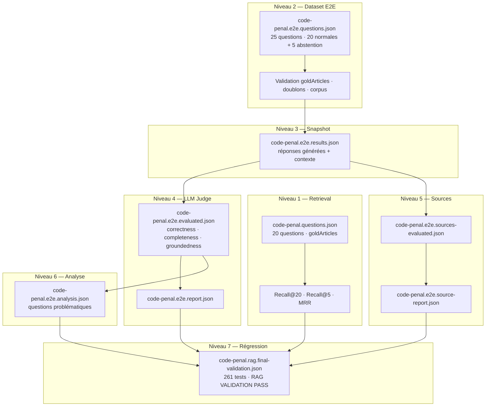

---

### Niveau 1 — Benchmark retrieval

**Objectif :** mesurer la qualité du retrieval + reranking **sans** appeler le LLM génératif. On isole ainsi la couche « retrouver le bon article ».

**Dataset :** `data/evaluation/code-penal.questions.json` — **20 questions** avec `goldArticles` (numéros d'articles attendus dans le top-K).

**Métriques calculées par question :**

| Métrique | Définition | Seuil projet |
|----------|------------|--------------|
| **Recall@20 (vector)** | Au moins un `goldArticle` présent dans le top-20 cosine | 1 = succès |
| **Recall@5 (vector)** | Idem dans le top-5 vectoriel (slice du top-20) | 1 = succès |
| **Recall@5 (Jina)** | Idem après reranking Jina v3.5 | 1 = succès |
| **MRR (vector / Jina)** | Mean Reciprocal Rank du premier gold article | 0–1, plus haut = mieux |
| **Amélioration Jina** | `recallAt5Jina − recallAt5Vector` et `mrrJina − mrrVector` | Points gagnés |

**Résultats mesurés (septembre 2026) :**

| Métrique | Vector | Jina | Δ Jina |
|----------|--------|------|--------|
| Recall@20 | **100 %** | — | — |
| Recall@5 | **100 %** | **100 %** | **+0 pt** |
| MRR | **0,975** | **0,975** | **+0** |

<div class="callout callout-choose">
<strong>Interprétation — Jina +0</strong>
Sur ce benchmark, le reranker **ne déplace pas le plafond** Recall@5/MRR : le top-5 vectoriel contient déjà le bon article dans 100 % des cas. Jina reste en place pour le **filtrage de contexte dynamique** (scores relatifs) et pour les cas où le corpus grossira. Ne pas retirer Jina « parce que +0 sur Recall » sans mesurer l'impact sur l'E2E et les sources.
</div>

**Implémentation :** `src/evaluation/run-retrieval-evaluation.ts`, `src/evaluation/evaluate-question-metrics.ts`.

**Profiling moyen par question :** embedding ~267 ms · recherche vectorielle ~49 ms · reranking Jina ~265 ms · total ~581 ms.

---

### Niveau 2 — Dataset E2E

**Objectif :** garantir que le jeu de test end-to-end est **cohérent, non dupliqué et ancré dans le corpus** avant de consommer des tokens de génération/judge.

**Dataset :** `data/evaluation/code-penal.e2e.questions.json` — **25 questions** :

| Catégorie | Nombre | Rôle |
|-----------|--------|------|
| Questions normales | 20 | Réponse attendue fondée sur le Code pénal |
| Questions abstention | 5 | Hors corpus (droit civil, fiscal, social…) — le système doit refuser de répondre |

Chaque question normale possède : `id` (`q001`…`q025`), `question`, `goldArticles`, `referenceAnswer`, `expectedAbstention: false`.

Les questions d'abstention ont `goldArticles: []`, `referenceAnswer: null`, `expectedAbstention: true`.

**Validations exécutées (`validate:e2e-dataset`) :**

<ul>
<li>Format des IDs (<code>q\d{3}</code>)</li>
<li>Absence de doublons d'ID ou de texte de question</li>
<li><code>goldArticles</code> présents dans le corpus (1 301 articles)</li>
<li><code>referenceAnswer</code> non vide pour les questions normales</li>
<li>Ratio 20/5 normales/abstention</li>
</ul>

<div class="callout callout-trap">
<strong>Piège fréquent</strong>
Construire un benchmark E2E uniquement avec des questions « faciles » du domaine couvert. Sans questions d'abstention, un RAG hallucine en confiance sur des sujets hors corpus — et le judge ne le détectera pas.
</div>

---

### Niveau 3 — Snapshot E2E

**Objectif :** exécuter le **pipeline complet** (retrieval → reranking → filtrage contexte 40 % → génération) sur les 25 questions et **figer** les résultats dans un snapshot reproductible.

**Commande :** `pnpm evaluate:e2e`

**Artefact :** `data/evaluation/results/code-penal.e2e.results.json`

**Contenu par question :**

<ul>
<li>Question et métadonnées (<code>expectedAbstention</code>, <code>goldArticles</code>)</li>
<li><code>retrievedChunks</code> (top-20), <code>rerankedChunks</code> (top-5 Jina)</li>
<li><code>filteredContextChunks</code> après seuil relatif 0,4</li>
<li><code>context</code> textuel injecté au LLM</li>
<li><code>generatedAnswer</code></li>
<li>Timings détaillés (embedding, vector, Jina, génération, total)</li>
</ul>

**Vérification snapshot :** `verifyE2EResultsSnapshot()` dans `src/evaluation/verify-e2e-snapshots.ts` — contrôle la structure, les statuts, l'absence de champs manquants.

**Latence moyenne mesurée :**

| Segment | Toutes questions | Normales | Abstention |
|---------|------------------|----------|------------|
| Latence totale | 3 368 ms | 3 589 ms | 2 484 ms |
| Caractères contexte | 1 199 | 1 255 | 972 |
| Chunks filtrés | 1,64 | 1,75 | 1,20 |

<div class="callout callout-retain">
<strong>À retenir</strong>
Le snapshot est la <strong>source de vérité</strong> pour le judge et l'évaluation sources. Ne jamais juger des réponses « à la main » en prod — toujours comparer à un snapshot versionné.
</div>

---

### Niveau 4 — LLM judge

**Objectif :** évaluer automatiquement la qualité des réponses générées via un **LLM-as-a-judge** structuré (JSON schema strict).

**Commandes :** `pnpm evaluate:e2e:judge` puis `pnpm report:e2e`

**Modèle judge :** `gpt-5.6-luna` (configurable via `RAG_EVALUATION_JUDGE_MODEL`)

**Critères (échelle 0–4, seuil de passage ≥ 3) :**

| Critère | Description | Questions évaluées |
|---------|-------------|-------------------|
| **correctness** | Exactitude juridique de la réponse | 20 normales |
| **completeness** | Couverture des éléments essentiels | 20 normales |
| **groundedness** | Chaque affirmation étayée par le contexte | 20 normales |
| **abstentionCorrect** | Refus justifié quand le corpus est insuffisant | 5 abstention |

**Résultats mesurés — questions normales (n = 20) :**

| Métrique | Moyenne | Pass rate (≥ 3) | Distribution |
|----------|---------|-----------------|--------------|
| Correctness | **3,95** | **100 %** | 19× score 4 · 1× score 3 |
| Completeness | **3,95** | **100 %** | 19× score 4 · 1× score 3 |
| Groundedness | **4,00** | **100 %** | 20× score 4 |

**Résultats mesurés — abstention (n = 5) :**

| Métrique | Valeur |
|----------|--------|
| Abstention correcte | **5 / 5** |
| Précision abstention | **100 %** |
| Échecs | **0** (`failedQuestionIds: []`) |

**Questions problématiques :** **0** — aucune question ne tombe sous le seuil 3 sur correctness, completeness ou groundedness, et aucune abstention incorrecte.

<div class="callout callout-trap">
<strong>Piège fréquent — biais same-model</strong>
Le modèle de génération et le modèle judge sont identiques (<code>gpt-5.6-luna</code>). Le judge peut être indulgent avec le style et les formulations du générateur. Limite documentée — voir section 17. Pour une validation externe, utiliser un judge de famille différente ou une revue humaine ciblée.
</div>

**Artefacts :**

<ul>
<li><code>code-penal.e2e.evaluated.json</code> — scores + explications par question</li>
<li><code>code-penal.e2e.report.json</code> — agrégats, distributions, latence</li>
</ul>

---

### Niveau 5 — Évaluation des sources

**Objectif :** évaluer séparément si les **chunks effectivement cités** dans le contexte filtré sont pertinents pour la question et suffisants pour justifier la réponse (y compris l'abstention).

**Commande :** `pnpm evaluate:e2e:sources`

**Critères (échelle 0–4, seuil ≥ 3) :**

| Critère | Question posée au judge |
|---------|-------------------------|
| **sourceRelevance** | Les sources fournies sont-elles pertinentes pour répondre à la question ? |
| **sourceCoverage** | Les sources couvrent-elles ce que la réponse affirme (ou l'abstention) ? |

**Résultats mesurés (n = 25) :**

| Métrique | Moyenne | Pass rate (≥ 3) |
|----------|---------|-----------------|
| Source relevance | **3,64** | **88 %** (22/25) |
| Source coverage | **4,00** | **100 %** (25/25) |

**Distribution source relevance :** 20× score 4 · 2× score 3 · 2× score 2 · 1× score 1 · 0× score 0

**Questions à relevance faible (< 3) — abstention attendue :**

| ID | Question (abrégée) | Relevance | Coverage | Diagnostic |
|----|-------------------|-----------|----------|------------|
| **q021** | Contrat de mariage (droit civil) | **2** | 4 | R645-3 match lexical « mariage » — hors sujet |
| **q024** | Quorum SA (droit des sociétés) | **2** | 4 | R712-8 — texte pénal sans lien |
| **q025** | Préavis licenciement économique | **1** | 4 | R131-53 / R722-5 — bruit sémantique faible |

<div class="callout callout-choose">
<strong>Interprétation</strong>
Relevance faible + coverage 4 sur les abstentions = comportement <strong>acceptable</strong>. Le retrieval remonte du bruit lexical, mais le LLM s'abstient correctement et le judge confirme que les sources ne permettent pas de répondre. Améliorer le filtrage ou ajouter un seuil de confiance retrieval pour réduire le bruit — pas pour « mieux répondre » à des questions hors corpus.
</div>

---

### Niveau 6 — Analyse question par question

**Objectif :** produire une vue **granulaire** pour le debug : chunks retenus, réponse générée, scores judge, flag « problématique ».

**Commande :** `pnpm analyze:e2e-results`

**Artefact :** `data/evaluation/results/code-penal.e2e.analysis.json`

**Règle « problématique »** (`build-e2e-analysis.ts`) :

<ul>
<li>Question normale : correctness &lt; 3 OU completeness &lt; 3 OU groundedness &lt; 3</li>
<li>Question abstention : <code>abstentionCorrect === false</code></li>
</ul>

**Exemple détaillé — q014 (seul quasi-échec correctness/completeness) :**

| Champ | Valeur |
|-------|--------|
| Question | « Qu'est-ce que la non-assistance à personne en danger ? » |
| Gold | `223-6` |
| Chunks filtrés | `223-6#0`, `122-7#0`, `223-5#0` |
| Correctness | **3** |
| Completeness | **3** |
| Groundedness | **4** |
| Problématique ? | **Non** (≥ 3 partout) |

**Analyse :** la réponse décrit correctement le second cas de l'article 223-6 (abstention volontaire d'assister une personne en péril) mais **omet le premier cas** : ne pas empêcher immédiatement un crime/délit contre l'intégrité corporelle. Le judge pénalise la complétude sans remettre en cause l'ancrage (groundedness 4).

**Piste d'amélioration mesurée :** articles multi-cas (223-6) → vérifier si le chunking préserve les deux alinéas dans un seul chunk, ou ajuster le prompt pour expliciter « tous les cas prévus par l'article cité ».

---

### Niveau 7 — Régression et validation finale

**Objectif :** une commande unique vérifie tests unitaires, build, datasets, artefacts, cohérence inter-rapports et métriques — **gate de merge**.

**Commande :** `pnpm validate:rag` (avec flags CI : `--skip-project-checks --tests-passed --build-passed`)

**Artefact :** `data/evaluation/results/code-penal.rag.final-validation.json`

**Statut actuel :** **`PASS`** — 0 échec

| Bloc vérifié | Statut |
|--------------|--------|
| Tests projet | **261 pass** (5 skipped) |
| Build | pass |
| Dataset retrieval (20 q.) | pass |
| Dataset E2E (25 q.) | pass |
| Pipeline ingestion → génération | pass |
| Retrieval Recall@20/5 = 100 %, MRR = 0,975 | pass |
| E2E snapshot + judge + report | pass |
| Sources snapshot + report | pass |
| Limitations documentées | pass |
| Corpus chunks | 1 368 |

<div class="callout callout-retain">
<strong>À retenir</strong>
<code>validate:rag</code> est le <strong>Definition of Done</strong> automatisé du RAG. Toute modification de chunking, embedding, seuil de contexte ou prompt doit repasser cette commande avant merge.
</div>

---

<div class="section-break"></div>

## 12. Architecture d'évaluation complète

Schéma de bout en bout : de la question utilisateur aux gates de régression.

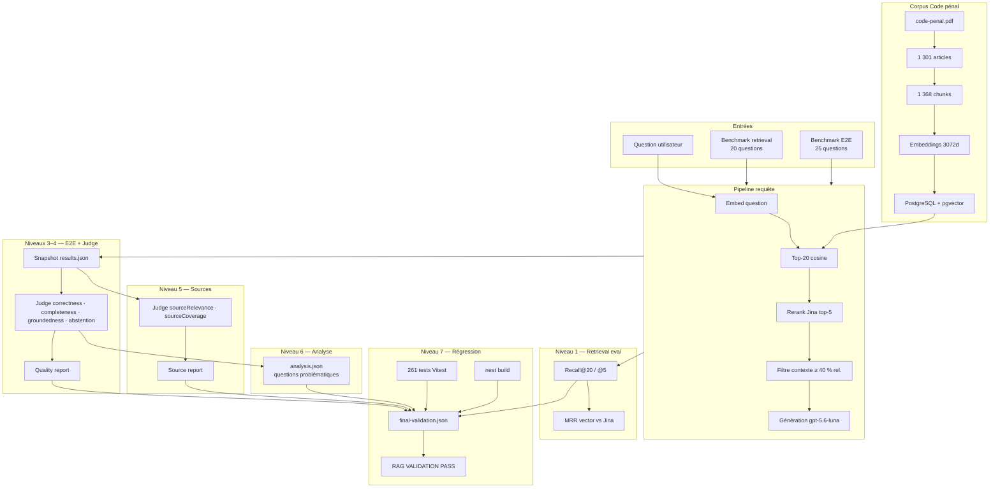

**Flux de données entre artefacts :**

```
evaluate:e2e          →  e2e.results.json
evaluate:e2e:judge    →  e2e.evaluated.json  +  e2e.report.json
evaluate:e2e:sources  →  e2e.sources-evaluated.json  +  e2e.source-report.json
analyze:e2e-results   →  e2e.analysis.json
validate:rag          →  rag.final-validation.json  (agrège tout)
```

---

<div class="section-break"></div>

## 13. Alternatives et arbres de décision

Arbres **transverses** — ils complètent les alternatives par section (ingestion, chunking, etc.).

### 13.1 Faut-il ajouter un reranker ?

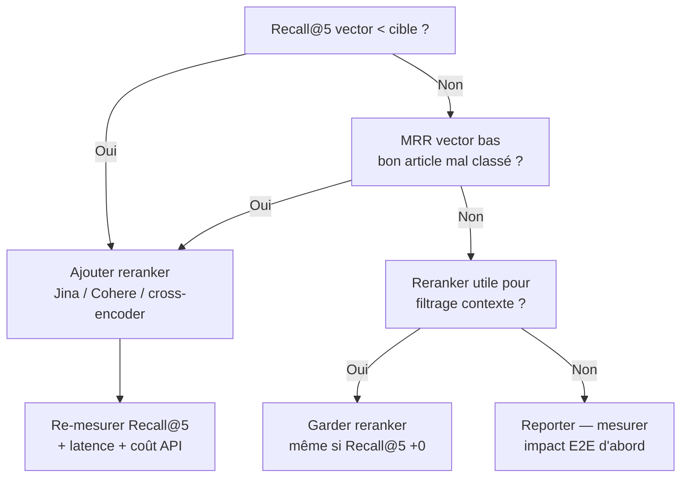

**Cas Code pénal :** Recall@5 vector = 100 %, MRR = 0,975, **Δ Jina = +0** — reranker retenu pour les scores relatifs du filtre contexte, pas pour le Recall.

### 13.2 Quel seuil de filtrage contexte ?

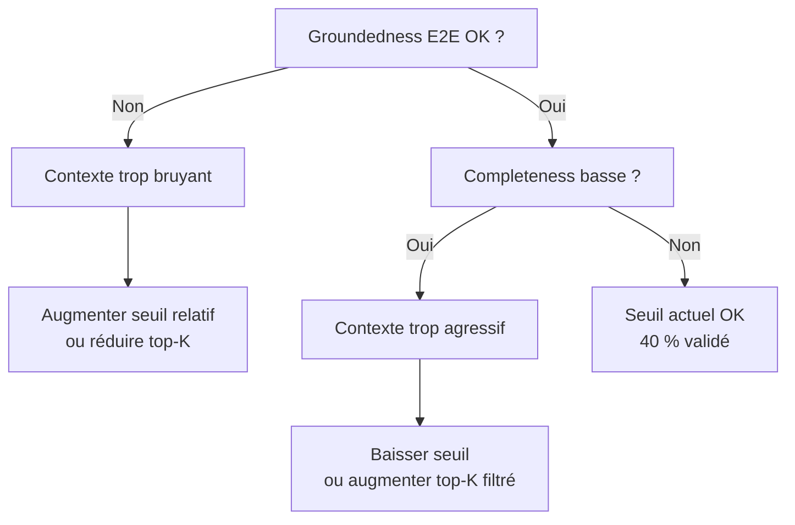

**Cas Code pénal :** seuil **0,4** (40 % du score relatif max Jina) — groundedness 4,0, 1,64 chunks filtrés en moyenne.

### 13.3 Faut-il un index HNSW / vector DB dédiée ?

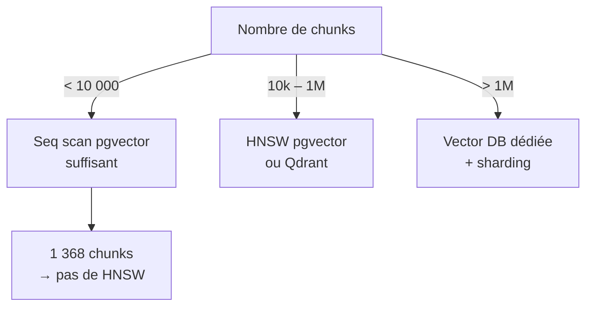

### 13.4 Faut-il étendre le benchmark avant d'optimiser ?

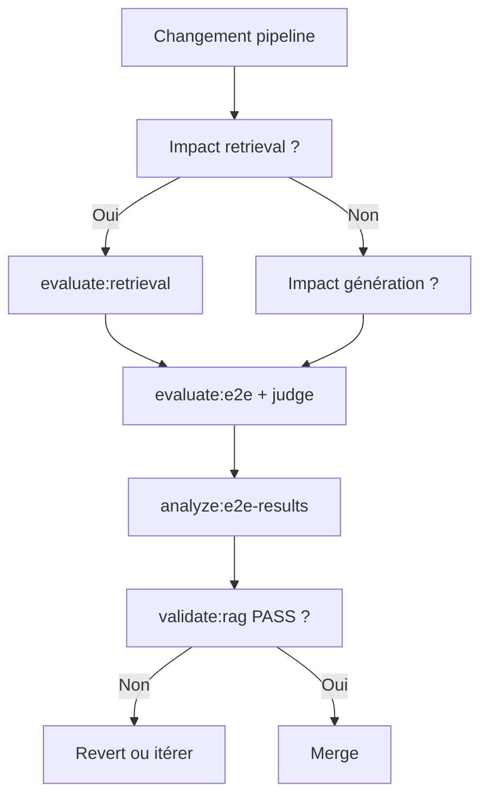

### 13.5 Question hors corpus — répondre ou s'abstenir ?

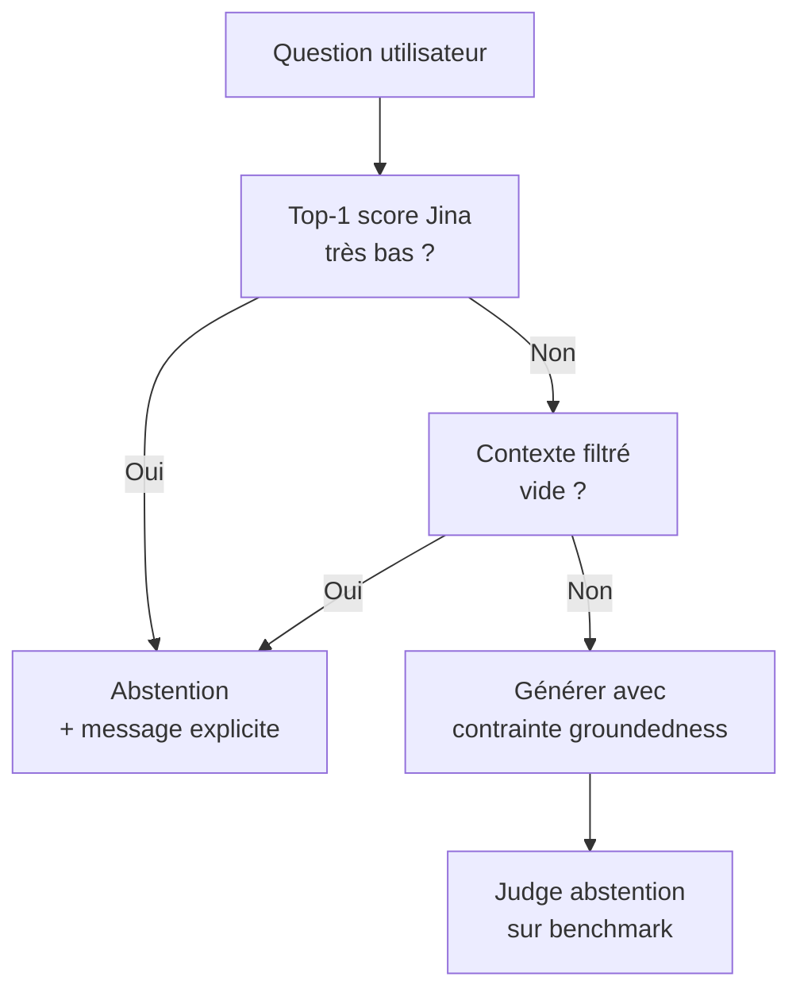

<div class="callout callout-choose">
<strong>Quand choisir quoi ?</strong>
<ul>
<li><strong>Métrique retrieval insuffisante</strong> → chunking, embedding ou top-K — pas le prompt</li>
<li><strong>Retrieval OK, réponses incomplètes</strong> → prompt, filtrage contexte, taille chunks</li>
<li><strong>Groundedness basse</strong> → réduire bruit contexte ou durcir instructions</li>
<li><strong>Abstention incorrecte</strong> → questions trap benchmark + seuil confiance retrieval</li>
</ul>
</div>

---

<div class="section-break"></div>

## 14. Diagnostic

Table de référence rapide : **symptôme → cause probable → mesure → solution**.

| Symptôme | Cause probable | Mesure | Solution |
|----------|----------------|--------|----------|
| Recall@20 bas | Chunking casse les articles ; mauvais embedding ; corpus incomplet | `evaluate:retrieval` par question | Revoir découpage ; ré-embedder ; compléter ingestion |
| Recall@20 OK, Recall@5 bas | Bon article rang 6–20 ; top-K vector trop large sans rerank | Comparer vector top-5 vs top-20 | Reranker ; réduire bruit avant Jina |
| MRR bas, Recall OK | Bon article trouvé mais mal ordonné | MRR par question dans retrieval eval | Reranker ; query expansion ; metadata boost |
| Jina Δ = +0 sur Recall | Corpus petit ; embedding déjà discriminant | `recallAt5ImprovementPoints`, `mrrImprovement` | Garder Jina si filtre contexte utile ; sinon évaluer coût/latence |
| Latence retrieval > 1 s | API embedding ; reranker ; pas d'index | Profiling dans results.json | Cache embedding ; batch ; HNSW si corpus grand |
| Correctness E2E basse | Prompt faible ; mauvais chunks ; hallucination | `e2e.analysis.json` + judge explanations | Prompt juridique strict ; améliorer retrieval |
| Completeness basse (ex. q014) | Article multi-cas ; chunk tronqué ; filtre contexte agressif | Compare gold vs chunks filtrés | Chunking verbatim ; abaisser seuil 40 % ; prompt « tous les cas » |
| Groundedness basse | Trop de chunks bruités ; LLM invente | Source eval + context length | Durcir filtre ; réduire top-K ; consigne « uniquement le contexte » |
| Abstention incorrecte (répond quand il faut refuser) | Pas de questions trap ; seuil confiance absent | 5 questions abstention benchmark | Ajouter abstention dataset ; seuil score Jina |
| Abstention incorrecte (refuse quand il faut répondre) | Seuil trop agressif ; retrieval échoue | q001–q020 judge scores | Baisser seuil ; élargir top-K ; debug goldArticles |
| Source relevance basse, coverage OK | Bruit lexical hors domaine (q021, q024, q025) | `lowSourceRelevanceQuestionIds` | Normal pour abstention ; filtre pre-gen si bruit gênant |
| Source coverage basse | Contexte insuffisant pour ce que la réponse affirme | sourceJudge explanations | Plus de chunks ; meilleur retrieval ; réponse plus courte |
| Questions problématiques > 0 | Régression pipeline ou prompt | `problematicQuestionIds` | Analyse par ID ; revert commit fautif |
| Snapshot invalid | Artefact corrompu ou schema changé | `verify-e2e-snapshots` | Régénérer `evaluate:e2e` |
| Judge incohérent | Schema LLM non respecté | `parse-e2e-judge-response` tests | Durcir JSON schema ; retry |
| validate:rag FAIL | Tests, build, ou métrique hors spec | `failures[]` dans final-validation | Corriger bloc en échec ; ne pas merge |
| Évaluation non reproductible | Modèle/API changé ; pas de snapshot | Comparer metadata judgeModel | Pinner modèle ; versionner artefacts |
| Multi-corpus confusion | Requête route vers mauvais index | Logs corpusId | Metadata filter ; router explicite (section 16) |
| Performance prod dégradée | Seq scan sur gros corpus | EXPLAIN sur requête vector | HNSW ; partition ; vector DB |
| Coût API élevé | Re-embed complet à chaque changement | Compter appels embed | Embed incrémental ; cache questions |

<div class="callout callout-trap">
<strong>Piège fréquent</strong>
Corriger le prompt quand le retrieval est en cause (ou l'inverse). Toujours identifier le **niveau d'évaluation** (1–7) où le symptôme apparaît avant d'agir.
</div>

---

<div class="section-break"></div>

## 15. Multi-corpus

Le blueprint actuel couvre **un seul corpus** : Code pénal français (1 301 articles, 1 368 chunks). La plupart des applications production finissent par en héberger plusieurs (codes adjacentes, jurisprudence, notes internes).

### Principes de conception

| Principe | Recommandation |
|----------|----------------|
| **Isolation des index** | Un namespace par corpus : colonne `corpus_id`, table séparée, ou base dédiée |
| **Routing explicite** | Ne jamais mélanger les embeddings de corpus différents dans une seule recherche aveugle |
| **Benchmark par corpus** | Dataset retrieval + E2E **par corpus** ; pas de goldArticles cross-corpus |
| **Abstention inter-corpus** | Questions trap : « droit civil » sur corpus pénal → abstention obligatoire |
| **Évaluation agrégée** | `validate:rag` par corpus, puis gate global optionnel |

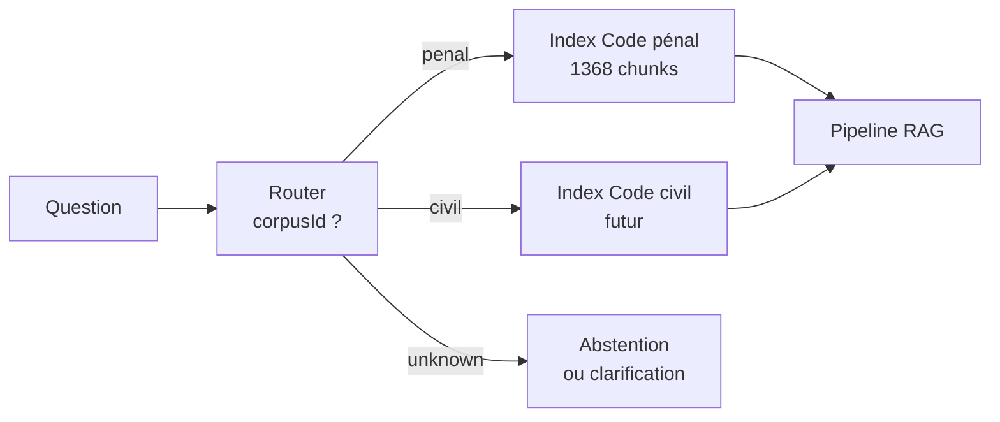

### Extension progressive

1. **Phase 1 (actuel)** — corpus unique, benchmark complet, RAG VALIDATION PASS.
2. **Phase 2** — ajouter `corpusId` au schéma Prisma + filtre `WHERE corpus_id = $1` dans `searchSimilarChunks`.
3. **Phase 3** — router LLM ou règles métier choisissent le corpus avant retrieval.
4. **Phase 4** — fusion contrôlée (multi-retrieval) uniquement si mesurée utile sur benchmark dédié.

<div class="callout callout-choose">
<strong>Quand fusionner plusieurs corpus ?</strong>
<ul>
<li><strong>Jamais par défaut</strong> — le bruit cross-domaine reproduit les cas q021/q024/q025 à grande échelle</li>
<li><strong>Si question transversale explicite</strong> — retrieval parallèle + rerank unifié + budget contexte doublé — à benchmarker</li>
<li><strong>Si même domaine</strong> — ex. Code pénal + Code procédure pénale — router d'abord, fusion ensuite si Recall E2E le justifie</li>
</ul>
</div>

---

<div class="section-break"></div>

## 16. Limites du projet

Limites **honestes**, validées dans `final-rag-validation.json` → bloc `limitations`. Ce ne sont pas des bugs — ce sont des contraintes connues et acceptées.

| Limite | Description | Impact | Mitigation |
|--------|-------------|--------|------------|
| **Métriques spécifiques au benchmark** | 20 q. retrieval, 25 q. E2E — non représentatif de toute la jurisprudence | Couverture partielle du Code pénal | Enrichir dataset avant prod ; monitoring utilisateur |
| **Biais same-model judge** | Génération et judge = `gpt-5.6-luna` | Scores potentiellement optimistes | Judge externe ; échantillon revue humaine |
| **Seuil contexte 40 % non universalisé** | Validé sur ce corpus uniquement | Peut être sous-optimal ailleurs | `analyze:reranker-sensitivity` ; A/B par corpus |
| **Petit corpus, pas de HNSW** | 1 368 chunks — seq scan pgvector | Non reproductible à 1 M+ chunks sans retravail infra | Planifier HNSW / Qdrant avant scale |
| **Jina +0 sur métriques globales** | Recall@5 et MRR identiques vector vs Jina | Coût/latence rerank sans gain retrieval mesuré | Justifié par filtrage contexte ; re-mesurer si corpus grossit |
| **Un seul PDF source** | Pas de mise à jour Légifrance automatisée | Corpus statique | Pipeline re-ingestion périodique |
| **Pas de recherche hybride BM25** | Vector-only | Termes rares ou numéros d'articles exacts | pg_trgm ou OpenSearch si échecs mesurés |
| **Modèles OpenAI + Jina** | Dépendance API, coût, latence | Indisponibilité fournisseur | Fallback local si exigence on-premise |
| **Français juridique uniquement** | Pas de benchmark multilingue | — | Dataset par langue |
| **Sections 7–11 non couvertes ici** | Retrieval, reranking, contexte, génération détaillés ailleurs | Blueprint partiel | Compléter sections pipeline |

<div class="callout callout-retain">
<strong>À retenir</strong>
Documenter les limites <strong>avant</strong> qu'un stakeholder les découvre en production. Le statut PASS signifie « conforme au contrat d'évaluation défini » — pas « parfait en conditions réelles ».
</div>

---

<div class="section-break"></div>

## 17. Definition of Done

Checklist finale — un RAG Code pénal (ou fork de ce blueprint) est **done** quand tous les items sont cochés.

### Corpus et pipeline

<ul class="checklist">
<li>PDF ingéré, 1 301 articles extraits et validés</li>
<li>1 368 chunks produits, stratégie chunking documentée</li>
<li>Embeddings 3072d générés et importés en PostgreSQL</li>
<li>Import idempotent vérifié (<code>pnpm import:code-penal</code> relançable)</li>
<li>Pipeline requête fonctionnel : retrieval → Jina → filtre 40 % → génération</li>
</ul>

### Tests unitaires et intégration

<ul class="checklist">
<li><strong>261 tests</strong> Vitest passent (<code>pnpm test</code>)</li>
<li>Build NestJS pass (<code>pnpm build</code>)</li>
<li>Tests d'intégration retrieval contre base pgvector réelle</li>
</ul>

### Benchmark retrieval (niveau 1)

<ul class="checklist">
<li>20 questions, goldArticles validés dans le corpus</li>
<li>Recall@20 = <strong>100 %</strong></li>
<li>Recall@5 (vector et Jina) = <strong>100 %</strong></li>
<li>MRR ≥ <strong>0,975</strong></li>
<li>Δ Jina documenté (ici : +0 — acceptable avec justification filtre contexte)</li>
</ul>

### Benchmark E2E (niveaux 2–4)

<ul class="checklist">
<li>25 questions E2E validées (<code>validate:e2e-dataset</code>)</li>
<li>Snapshot <code>e2e.results.json</code> régénéré et vérifié</li>
<li>Judge : correctness / completeness ≥ <strong>3,95</strong> moyenne, pass rate 100 %</li>
<li>Judge : groundedness = <strong>4,0</strong>, pass rate 100 %</li>
<li>Abstention : <strong>100 %</strong> (5/5)</li>
<li><strong>0</strong> question problématique</li>
</ul>

### Évaluation sources (niveau 5)

<ul class="checklist">
<li>Source relevance moyenne ≥ 3,5 (actuel : <strong>3,64</strong>)</li>
<li>Source coverage moyenne = <strong>4,0</strong></li>
<li>Pass rate relevance ≥ 85 % (actuel : <strong>88 %</strong>)</li>
<li>Pass rate coverage = <strong>100 %</strong></li>
<li>Questions faible relevance (q021, q024, q025) comprises et acceptées ou corrigées</li>
</ul>

### Régression (niveau 7)

<ul class="checklist">
<li><code>pnpm validate:rag</code> → statut <strong>RAG VALIDATION PASS</strong></li>
<li>Artefact <code>code-penal.rag.final-validation.json</code> committé ou CI-artefact</li>
<li>Aucune entrée dans <code>failures[]</code></li>
</ul>

### Documentation et ops

<ul class="checklist">
<li>Limites section 17 communiquées aux stakeholders</li>
<li>Modèles et versions pinées (embedding, reranker, judge, générateur)</li>
<li>Variables d'environnement documentées (<code>.env.example</code>)</li>
<li>Plan multi-corpus défini si extension prévue (section 16)</li>
</ul>

---

<div class="section-break"></div>

## 18. Règle fondamentale

<div class="callout callout-retain">

**Don't add complexity without a measured problem.**

*Ne ajoute pas de complexité sans un problème mesuré.*

</div>

Toute décision d'architecture dans ce blueprint — reranker Jina, filtre contexte à 40 %, embeddings 3072d, LLM judge en sept niveaux — doit pouvoir répondre à trois questions :

1. **Quel symptôme mesurable ?** (ex. Recall@5 = 80 %, groundedness &lt; 3, latence &gt; 5 s)
2. **Quelle métrique avant/après ?** (ex. Recall@5 → 100 %, MRR 0,85 → 0,975)
3. **Quel coût ?** (latence +265 ms Jina, coût API, complexité ops, dette de tests)

**Exemples concrets Code pénal :**

| Décision | Problème mesuré ? | Verdict |
|----------|-------------------|---------|
| Reranker Jina | Recall +0, mais filtrage contexte nécessite scores relatifs | ✅ Justifié |
| Index HNSW | 1 368 chunks, seq scan &lt; 50 ms | ❌ Reporter |
| 7 niveaux d'évaluation | Livraison sans preuve → risque prod | ✅ Justifié |
| Hybrid BM25 | Recall@20 déjà 100 % | ❌ Pas de problème mesuré |
| Prompt « tous les cas article » (q014) | Completeness 3/4 sur 223-6 | ⚠️ À mesurer après changement |

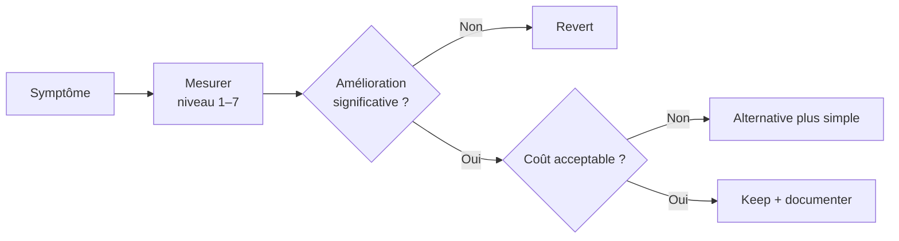

<div class="callout callout-trap">
<strong>Anti-pattern</strong>
Ajouter Pinecone, un second reranker, ou un agent multi-étapes parce que « c'est ce que font les RAG en 2026 ». Si <code>validate:rag</code> est PASS et qu'aucune métrique ne régresse, la complexité supplémentaire est de la dette — pas de la valeur.
</div>

---

<p class="meta"><em>Blueprint RAG Code pénal — sections 12–19 · Métriques septembre 2026 · 261 tests · RAG VALIDATION PASS</em></p>
